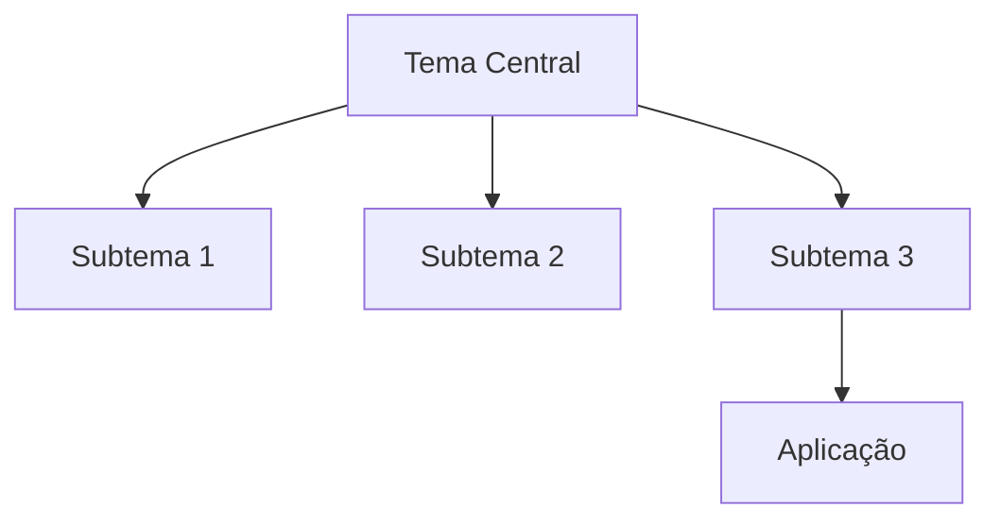
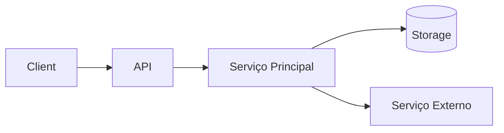

# TEMPLATE DE CAPÍTULO DIDÁTICO AVANÇADO

> Preencha as seções conforme o tema. Todas as seções marcadas com **(Se aplicável)** podem ser omitidas ou fundidas quando não fizerem sentido para o tópico escolhido.

---

## Metadados do Capítulo

| Campo                            | Valor (preencher)                                              |
| -------------------------------- | -------------------------------------------------------------- |
| Título do Capítulo               |                                                                |
| Número / Parte                   |                                                                |
| Tema Central                     |                                                                |
| Disciplina / Livro               |                                                                |
| Nível da Audiência               | (Iniciante / Intermediário / Avançado)                         |
| Perfil do Leitor                 | (Ex.: Dev backend, Cientista de Dados, Estudante de Graduação) |
| Pré-requisitos                   |                                                                |
| Capítulos Anteriores Necessários |                                                                |
| Capítulos Seguintes Relacionados |                                                                |
| Última Revisão                   |                                                                |
| Autor                            |                                                                |

---

## 1. Introdução

### 1.1 Contextualização

Descreva o cenário histórico, técnico ou de mercado que torna o tema relevante.

### 1.2 Problema / Lacuna

Quais dores ou limitações o capítulo endereça? Qual falha comum em projetos reais?

### 1.3 Objetivos de Aprendizagem

Liste objetivos mensuráveis.

* OA1:
* OA2:
* OA3:

### 1.4 Mapa Mental / Visão Geral **(Se aplicável)**



### 1.5 Conexão com Outros Capítulos **(Se aplicável)**

Explique dependências e preparação para conteúdos futuros.

---

## 2. Fundamentação Teórica

### 2.1 Definições Formais

Definições rigorosas de termos-chave.

### 2.2 Princípios / Postulados

Liste e explique cada princípio com exemplos.

### 2.3 Modelos, Arquiteturas ou Padrões Relacionados **(Se aplicável)**

* Modelo A: descrição, quando aplicar.
* Padrão B: vantagens e limites.

### 2.4 Notação / Convenções Utilizadas **(Se aplicável)**

Apresente símbolos, pseudocódigo, tipagem, abreviações.

### 2.5 Relação com Outras Disciplinas **(Se aplicável)**

Conexões (ex.: Segurança, Banco de Dados, UX, Engenharia de Software).

---

## 3. Desenvolvimento Detalhado

> Divida em subseções temáticas. Cada subseção deve conter: introdução breve, explicação, exemplo, análise crítica.

### 3.x Subtítulo Principal

**Objetivo local:** Qual microcompetência o leitor adquire aqui.

#### 3.x.1 Conceito

Texto discursivo aprofundado.

#### 3.x.2 Exemplo Base **(Se aplicável)**

```linguagem
# Código / pseudocódigo ilustrativo
```

#### 3.x.3 Variações / Extensões **(Se aplicável)**

Como adaptar, generalizar ou otimizar.

#### 3.x.4 Análise de Complexidade / Desempenho **(Se aplicável)**

Detalhe Big-O, custos de espaço, latência, throughput.

#### 3.x.5 Armadilhas Comuns

Lista + impacto + prevenção.

#### 3.x.6 Boas Práticas Específicas

Racional técnico por trás de cada recomendação.

---

## 4. Integração Prática / Estudo de Caso **(Se aplicável)**

### 4.1 Cenário Descrito

Contexto (empresa fictícia, dataset, sistema legado...).

### 4.2 Requisitos Funcionais e Não Funcionais

Tabela de requisitos com indicadores.

### 4.3 Arquitetura Conceitual



### 4.4 Passos de Implementação

Checklist sequencial.

### 4.5 Código / Configuração Chave **(Se aplicável)**

```linguagem
# Trechos essenciais comentados
```

### 4.6 Métricas e Monitoramento **(Se aplicável)**

Quais KPIs validar.

### 4.7 Lições Aprendidas

Resumo crítico.

---

## 5. Comparação Crítica **(Se aplicável)**

### 5.1 Tabela Comparativa

| Critério | Abordagem A | Abordagem B | Abordagem C | Observações |
| -------- | ----------- | ----------- | ----------- | ----------- |

### 5.2 Vantagens e Desvantagens Contextualizadas

Quando cada abordagem é superior.

### 5.3 Limitações Atuais e Desafios Abertos

Gargalos técnicos, pesquisa em andamento.

---

## 6. Segurança, Confiabilidade e Qualidade **(Se aplicável)**

* Ameaças típicas / Vetores de falha
* Estratégias de mitigação
* Testes (unitário, integração, carga, fuzzing)

---

## 7. Performance e Escalabilidade **(Se aplicável)**

### 7.1 Modelagem de Carga

Cenários de uso, picos, padrões de tráfego.

### 7.2 Estratégias de Otimização

Caching, paralelismo, profiling.

### 7.3 Benchmarks (Template)

| Versão | Cenário | Latência P50 | P95 | Throughput | Observações |
| ------ | ------- | ------------ | --- | ---------- | ----------- |

---

## 8. Observabilidade e Manutenibilidade **(Se aplicável)**

* Logging estruturado
* Tracing distribuído
* Métricas técnicas e de negócio
* Planejamento de refatorações

---

## 9. Extensões e Evolução **(Se aplicável)**

Caminhos de evolução, modularização, migração tecnológica.

---

## 10. Exercícios e Atividades

### 10.1 Questões Conceituais

1.
2.
3.

### 10.2 Exercícios Práticos **(Se aplicável)**

1.
2.
3.

### 10.3 Desafio / Projeto Integrador **(Se aplicável)**

Descrição detalhada do mini-projeto.

### 10.4 Rubrica de Avaliação (Template) **(Se aplicável)**

| Critério | Peso | Nível Excelente | Nível Bom | Nível Insuficiente |
| -------- | ---- | --------------- | --------- | ------------------ |

---

## 11. Glossário **(Se aplicável)**

| Termo | Definição | Referência Cruzada |
| ----- | --------- | ------------------ |

---

## 12. Referências Bibliográficas

> Use padrão (ABNT / IEEE / APA) consistente.

* SOBRENOME, A. Título...

### 12.1 Leituras Complementares **(Se aplicável)**

* Artigos, RFCs, whitepapers.

### 12.2 Recursos Online **(Se aplicável)**

* Documentação oficial, repositórios.

---

## 13. Apêndices **(Se aplicável)**

### 13.1 Pseudocódigo Consolidado

### 13.2 Scripts de Automação

### 13.3 Tabelas de Dados

---

## 14. Guia para Instrutor **(Se aplicável)**

| Item                    | Descrição |
| ----------------------- | --------- |
| Dificuldades comuns     |           |
| Estratégias de mediação |           |
| Sugestões de debate     |           |

---

## 15. Feedback e Melhoria Contínua **(Se aplicável)**

### 15.1 Instrumento de Feedback

Perguntas objetivas e abertas.

### 15.2 Histórico de Revisões

| Data | Alteração | Autor |
| ---- | --------- | ----- |

---

## 16. Síntese Final

Resumo crítico conectando objetivos e entregas cognitivas alcançadas.

> **Nota do Autor:** Espaço para reflexão, limitações e próximos passos sugeridos.
