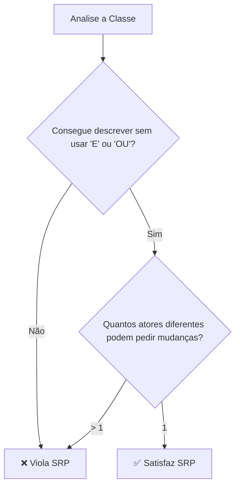
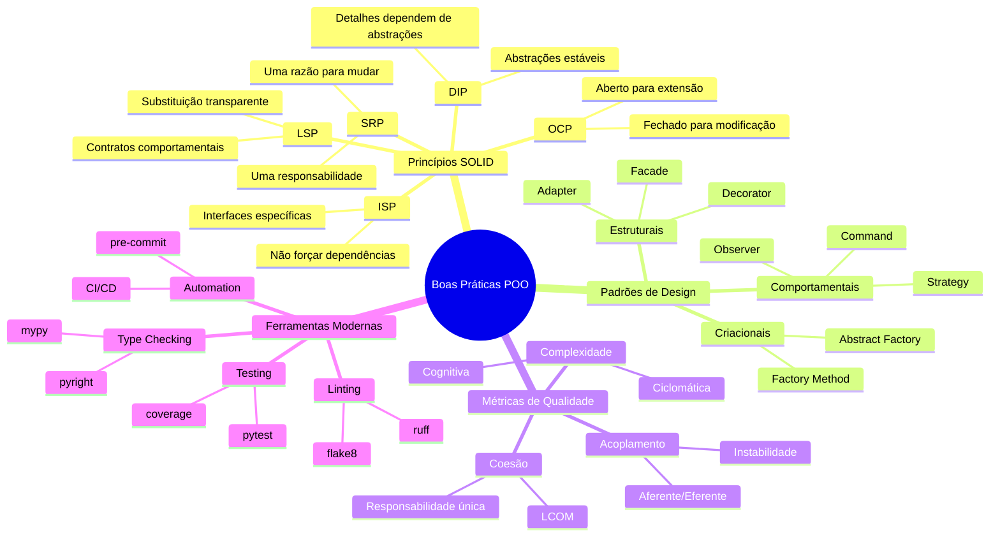

# Boas Práticas e Design Patterns Clássicos

## Sumário

1. [Abertura e Engajamento](#1-abertura-e-engajamento)
   - 1.1. [Problema Motivador](#11-problema-motivador)
   - 1.2. [Contexto Histórico e Relevância Atual](#12-contexto-histórico-e-relevância-atual)

2. [Fundamentos Teóricos](#2-fundamentos-teóricos)
   - 2.1. [Terminologia Essencial e Definições Formais](#21-terminologia-essencial-e-definições-formais)
   - 2.2. [Os Pilares das Boas Práticas em POO](#22-os-pilares-das-boas-práticas-em-poo)
   - 2.3. [Modelagem Matemática da Qualidade de Software](#23-modelagem-matemática-da-qualidade-de-software)
   - 2.4. [Análise Crítica](#24-análise-crítica)

3. [Aplicação Prática e Implementação](#3-aplicação-prática-e-implementação)
   - 3.1. [Estudo de Caso Guiado](#31-estudo-de-caso-guiado)
   - 3.2. [Exemplos de Código Comentado](#32-exemplos-de-código-comentado)
   - 3.3. [Ferramentas, Bibliotecas e Ecossistema](#33-ferramentas-bibliotecas-e-ecossistema)

4. [Tópicos Avançados e Nuances](#4-tópicos-avançados-e-nuances)
   - 4.1. [Desafios Comuns e Anti-Padrões](#41-desafios-comuns-e-anti-padrões)
5. [Síntese e Perspectivas Futuras](#5-síntese-e-perspectivas-futuras)
   - 5.1. [Conexões com Outras Áreas da Computação](#51-conexões-com-outras-áreas-da-computação)
   - 5.2. [A Fronteira da Pesquisa e o Futuro](#52-a-fronteira-da-pesquisa-e-o-futuro)
   - 5.3. [Resumo do Capítulo e Mapa Mental](#53-resumo-do-capítulo-e-mapa-mental)
   - 5.4. [Referências e Leituras Adicionais](#54-referências-e-leituras-adicionais)

---

## 1. Abertura e Engajamento

### 1.1. Problema Motivador

Imagine que você acabou de ser contratado como desenvolvedor em uma empresa de tecnologia promissora. No seu primeiro dia, você recebe a tarefa de adicionar uma nova funcionalidade ao sistema principal da empresa - um software de gestão bibliotecária que atende centenas de bibliotecas universitárias. Ao abrir o código, você se depara com um arquivo Python de 2.000 linhas, onde uma única classe chamada `BibliotecaManager` controla absolutamente tudo: cadastro de livros, gestão de usuários, cálculo de multas, geração de relatórios, envio de emails e até mesmo formatação de documentos para impressão.

Cada método tem mais de 100 linhas, variáveis têm nomes como `x1`, `temp` e `dados`, e para entender o que uma função faz, você precisa ler o código de outras dez funções. Pior ainda: não há testes automatizados, e toda mudança no código tem potencial para quebrar funcionalidades aparentemente não relacionadas. O último desenvolvedor que tentou adicionar uma funcionalidade simples - exibir a data de devolução prevista - acabou corrompendo o sistema de cálculo de multas, causando prejuízos financeiros significativos para a empresa.

### 1.2. Contexto Histórico e Relevância Atual
Os princípios **SOLID** foram formulados e popularizados por **Robert C. Martin** (Uncle Bob) a partir de 2000, sintetizando décadas de experiência em design orientado a objetos. Simultaneamente, **Kent Beck** introduzia o conceito de **código limpo** e práticas como TDD (Test-Driven Development), enquanto **Martin Fowler** sistematizava técnicas de refatoração que hoje são pilares da engenharia de software moderna.

Os **padrões de design** (design patterns) foram catalogados pela famosa "Gang of Four" - **Erich Gamma**, **Richard Helm**, **Ralph Johnson** e **John Vlissides** - no livro "Design Patterns: Elements of Reusable Object-Oriented Software" (1994), estabelecendo um vocabulário comum para soluções arquiteturais recorrentes.

**Relevância Atual:** Em 2025, esses princípios são mais cruciais do que nunca. Sistemas modernos como **microserviços**, **arquiteturas serverless**, **inteligência artificial** e **blockchain** dependem fundamentalmente de código bem estruturado para serem mantidos e escalados. Empresas como **Google**, **Netflix**, **Amazon** e **Microsoft** investem milhões em práticas de código limpo porque reconhecem que a velocidade de inovação está diretamente correlacionada à qualidade da base de código. Estudos recentes indicam que desenvolvedores passam **70% do tempo lendo código** e apenas 30% escrevendo - tornando a legibilidade não apenas uma questão estética, mas um imperativo econômico.

---

## 2. Fundamentos Teóricos

Antes de desenvolver a base teórica, analisamos a estrutura do conteúdo programático da aula e identificamos três blocos lógicos principais: **1) Apresentação da Disciplina**, **2) Revisão dos Princípios de Boas Práticas** (SOLID, DRY, YAGNI, KISS, Coesão e Acoplamento), e **3) Padrões de Design** (Strategy, Observer, Command, Factory Method, Singleton, Adapter). Cada bloco será desenvolvido iterativamente com profundidade teórica e rigor técnico adequados aos objetivos da disciplina.

### **2.1. Terminologia Essencial e Definições Formais**

#### **Código Limpo**
**Definição Formal:** Código limpo é um código que expressa claramente a intenção do programador, pode ser facilmente entendido, modificado e estendido por qualquer desenvolvedor competente (não apenas pelo autor original), minimiza a complexidade cognitiva necessária para compreensão e segue convenções consistentes que facilitam a manutenção.

**Analogia:** Código limpo é como um texto acadêmico bem estruturado - tem introdução clara, desenvolvimento lógico, conclusões consistentes e referências precisas. Qualquer especialista na área consegue compreender, criticar e expandir o trabalho sem consultar o autor original.

#### **Coesão**
**Definição Formal:** Coesão mede o grau em que os elementos dentro de um módulo (classe, função ou pacote) trabalham colaborativamente para um propósito único e bem definido. Alta coesão indica que todos os elementos do módulo contribuem harmonicamente para uma única responsabilidade bem delimitada.

**Analogia:** Uma equipe de cirurgia cardíaca tem alta coesão - cirurgião, anestesista, perfusionista e enfermeiros especializados têm papéis diferentes, mas todos trabalham coordenadamente para o mesmo objetivo específico: o sucesso da cirurgia cardíaca. Uma "equipe" formada por um cirurgião cardíaco, um chef de cozinha e um professor de física teria baixa coesão para qualquer objetivo prático.

#### **Acoplamento**
**Definição Formal:** Acoplamento mede o grau de interdependência entre diferentes módulos de software. Baixo acoplamento significa que mudanças em um módulo têm impacto mínimo e controlado em outros módulos, permitindo evolução independente e substituição de componentes.

**Analogia:** Sistemas com baixo acoplamento são como apartamentos em um condomínio moderno - cada unidade tem instalações independentes (elétrica, hidráulica, internet), e problemas ou reformas em um apartamento não afetam diretamente os outros. Sistemas com alto acoplamento são como casas antigas com fiação elétrica compartilhada - mexer na instalação de um cômodo pode causar problemas em toda a residência.

> **Analogia para Entender SOLID**
>
> **Imagine o funcionamento de um hospital de alta complexidade:**
>
> - **S (Single Responsibility):** Cada profissional tem UMA especialização bem definida - cardiologista só trata do coração, neurologista só do sistema nervoso. Nenhum médico tenta ser especialista em tudo simultaneamente.
>
> - **O (Open/Closed):** O hospital pode adicionar novas especialidades (oncologia, geriatria) sem modificar o funcionamento das especialidades existentes. Novos departamentos se integram ao sistema sem quebrar protocolos estabelecidos.
>
> - **L (Liskov Substitution):** Qualquer cardiologista qualificado pode substituir outro em plantão sem alterar o funcionamento do setor cardíaco. Pacientes continuam recebendo o mesmo padrão de atendimento.
>
> - **I (Interface Segregation):** Enfermeiros não precisam saber realizar cirurgias, apenas os protocolos de cuidado pós-operatório. Cada profissional tem acesso apenas às informações necessárias para sua função específica.
>
> - **D (Dependency Inversion):** Médicos trabalham com "protocolos de tratamento" padronizados em vez de métodos específicos, permitindo flexibilidade na escolha de medicamentos e procedimentos baseada em evidências atuais.

### **2.2. Estrutura Conceitual**

#### **2.2.1. Princípios de Boas Práticas - Base Científica do Design**

**Subtítulo: SOLID - Os Cinco Pilares da Arquitetura Orientada a Objetos**

##### **Single Responsibility Principle (SRP)**
**Teoria Detalhada:** Uma classe deve ter apenas uma razão para mudar, ou seja, deve ter apenas uma responsabilidade ou motivação para ser modificada. O SRP não limita o número de métodos, mas sim o número de **atores** ou **stakeholders** que podem solicitar mudanças na classe.

**Definição Matemática:** Para uma classe $C$ com conjunto de responsabilidades $R = \{r_1, r_2, ..., r_n\}$, o SRP é satisfeito quando $|R| = 1$.

**Fluxograma de Identificação de Violação:**


##### **Open/Closed Principle (OCP)**
**Teoria Detalhada:** Entidades de software devem estar **abertas para extensão** (novos comportamentos) mas **fechadas para modificação** (código existente não deve ser alterado). Isso é alcançado através de **abstrações**, **polimorfismo** e **injeção de dependência**.

**Mecanismos de Implementação:**
1. **Herança + Template Method:** Definir algoritmo base e permitir customização de steps específicos
2. **Composição + Strategy:** Delegar comportamentos variáveis para objetos intercambiáveis
3. **Interfaces + Dependency Injection:** Receber dependências abstratas externamente

**Pseudocódigo OCP:**
```
CLASSE AbstractBehavior:
    MÉTODO ABSTRATO executar()

CLASSE ConcreteBehavior1 HERDA AbstractBehavior:
    MÉTODO executar(): // implementação específica 1

CLASSE ConcreteBehavior2 HERDA AbstractBehavior:  
    MÉTODO executar(): // implementação específica 2

CLASSE Context:
    CONSTRUTOR(behavior: AbstractBehavior):
        this.behavior = behavior
    
    MÉTODO processo():
        // Código estável - nunca muda
        preparar()
        behavior.executar()  // Comportamento extensível  
        finalizar()
```

##### **Liskov Substitution Principle (LSP)**
**Teoria Detalhada:** Objetos de uma superclasse devem ser substituíveis por objetos de suas subclasses sem alterar a **correção** do programa. LSP garante que a herança preserve as **invariantes**, **pré-condições** e **pós-condições** da superclasse.

**Condições Formais para LSP:**
- **Pré-condições:** $Pre_{subclasse} \implies Pre_{superclasse}$ (subclasses não podem fortalecer)
- **Pós-condições:** $Post_{superclasse} \implies Post_{subclasse}$ (subclasses não podem enfraquecer)
- **Invariantes:** $Inv_{superclasse} \subseteq Inv_{subclasse}$ (propriedades devem ser mantidas)

##### **Interface Segregation Principle (ISP)**
**Teoria Detalhada:** Nenhum cliente deve ser forçado a depender de métodos que não utiliza. Interfaces grandes devem ser segmentadas em interfaces menores e mais específicas, aplicando o princípio da **responsabilidade única** ao nível de interfaces.

**Fórmula de Segregação:** Para uma interface $I$ com métodos $M = \{m_1, m_2, ..., m_n\}$ e clientes $C = \{c_1, c_2, ..., c_k\}$, ISP é violado quando $\exists c_i \in C: |M_{usado\_por\_c_i}| < |M|$.

##### **Dependency Inversion Principle (DIP)**
**Teoria Detalhada:** Módulos de alto nível não devem depender de módulos de baixo nível. Ambos devem depender de **abstrações**. Abstrações não devem depender de detalhes; detalhes devem depender de abstrações.

**Arquitetura DIP:**
```
Camada de Aplicação (Alto Nível)
         ↕ (depende apenas de)
Camada de Interfaces/Abstrações  
         ↕ (implementada por)
Camada de Implementação (Baixo Nível)
```

**Subtítulo: Princípios Complementares - Qualidade e Simplicidade**

##### **DRY (Don't Repeat Yourself)**
**Teoria Detalhada:** Cada pedaço de **conhecimento** (não código) deve ter uma representação única, autoritativa e não-ambígua no sistema. DRY foca em evitar duplicação de **lógica de negócio**, não necessariamente duplicação textual de código.

**Tipos de Duplicação:**
1. **Duplicação Inadvertida:** Desenvolvedor não percebe a repetição existente
2. **Duplicação por Impaciência:** Pressa leva a copiar código em vez de abstrair  
3. **Duplicação Interdeveloper:** Múltiplos desenvolvedores criam soluções similares
4. **Duplicação Acidental:** Códigos similares que evoluirão independentemente

##### **YAGNI (You Aren't Gonna Need It)**  
**Teoria Detalhada:** Não implemente funcionalidades baseadas em especulações sobre necessidades futuras. Adicione complexidade apenas quando há **demanda atual e específica**. YAGNI combate o **over-engineering** e **premature optimization**.

**Critérios para Violação YAGNI:**
- Código para requisitos não confirmados
- Abstrações sem pelo menos 2 casos de uso atuais
- Configurações para cenários hipotéticos
- APIs "extensíveis" sem consumidores definidos

##### **KISS (Keep It Simple, Stupid)**
**Teoria Detalhada:** A simplicidade deve ser um objetivo principal no design. A solução mais simples que resolve o problema é preferível à mais inteligente. Complexidade deve ser justificada por **benefícios concretos** e **requisitos específicos**.

**Heurísticas KISS:**
- Prefira código óbvio a código inteligente
- Use a ferramenta mais simples adequada ao problema
- Documente quando a complexidade for inevitável
- Meça complexidade antes de otimizar

**Subtítulo: Métricas de Coesão e Acoplamento - Quantificação da Qualidade**

**Classificação de Coesão (do menor ao maior nível):**
1. **Coincidental:** Elementos sem relação lógica agrupados arbitrariamente
2. **Lógica:** Elementos que fazem atividades similares mas não relacionadas
3. **Temporal:** Elementos executados aproximadamente ao mesmo tempo
4. **Procedimental:** Elementos que seguem uma sequência específica
5. **Comunicacional:** Elementos que operam sobre os mesmos dados
6. **Sequencial:** Saída de um elemento é entrada direta do próximo
7. **Funcional:** Todos os elementos contribuem para uma única tarefa (ideal)

**Classificação de Acoplamento (do maior ao menor nível):**
1. **Conteúdo:** Um módulo modifica dados internos de outro (pior)
2. **Comum:** Módulos compartilham dados através de variáveis globais
3. **Controle:** Um módulo controla o fluxo interno de outro
4. **Estampa:** Módulos compartilham estruturas de dados complexas
5. **Dados:** Módulos compartilham dados apenas via parâmetros simples
6. **Mensagem:** Comunicação via interfaces bem definidas (melhor)

#### **2.2.2. Padrões de Design - Soluções Catalogadas para Problemas Recorrentes**

**Subtítulo: Padrões Comportamentais - Gestão de Comunicação e Responsabilidades**

##### **Strategy Pattern**
**Teoria Detalhada:** Define uma família de algoritmos, encapsula cada um e os torna intercambiáveis em tempo de execução. Strategy permite que algoritmos variem independentemente dos clientes que os utilizam, implementando o **Open/Closed Principle** através de polimorfismo.

**Estrutura Formal:**
- **Context:** Mantém referência para uma estratégia e delega trabalho
- **Strategy (Interface):** Interface comum para todas as estratégias concretas  
- **ConcreteStrategy:** Implementações específicas de algoritmos

**Casos de Uso Típicos:**
- Algoritmos de ordenação intercambiáveis
- Estratégias de cálculo de impostos/descontos
- Algoritmos de compressão de dados
- Políticas de validação configuráveis

##### **Observer Pattern**
**Teoria Detalhada:** Define dependência um-para-muitos entre objetos, de forma que quando um objeto muda de estado, todos seus dependentes são notificados automaticamente. Observer implementa **baixo acoplamento** entre subject e observers através de interfaces abstratas.

**Componentes Estruturais:**
- **Subject:** Mantém lista de observers e os notifica sobre mudanças
- **Observer:** Interface para objetos que devem ser notificados
- **ConcreteObserver:** Implementações específicas de reação a notificações

##### **Command Pattern**  
**Teoria Detalhada:** Encapsula uma requisição como objeto, permitindo parametrizar clientes com diferentes requisições, enfileirar operações, registrar logs de operações e suportar undo/redo. Command transforma **ações** em **objetos de primeira classe**.

**Benefícios Arquiteturais:**
- Desacopla invocador de receptor
- Permite composição de comandos (macro commands)
- Facilita logging e auditoria
- Habilita operações de undo/redo

**Subtítulo: Padrões Criacionais - Controle Sofisticado de Instanciação**

##### **Factory Method Pattern**
**Teoria Detalhada:** Define interface para criar objetos, mas permite subclasses decidir qual classe instanciar. Factory Method delega a responsabilidade de criação para subclasses, seguindo o **Dependency Inversion Principle** e **Open/Closed Principle**.

**Motivação:** Quando uma classe não pode antecipar a classe de objetos que deve criar, ou quando uma classe quer que suas subclasses especifiquem os objetos que criam.

##### **Singleton Pattern**
**Teoria Detalhada:** Garante que uma classe tenha apenas uma instância e fornece ponto de acesso global a ela. Singleton é útil quando exatamente um objeto é necessário para coordenar ações pelo sistema (logger, cache, connection pool).

**Considerações de Implementação:**
- Thread-safety em ambientes concorrentes
- Lazy vs. eager initialization  
- Impacto na testabilidade (dificuldade de mock)
- Alternativas: Dependency Injection containers

**Subtítulo: Padrões Estruturais - Composição e Relacionamentos entre Classes**

##### **Adapter Pattern**
**Teoria Detalhada:** Permite que classes com interfaces incompatíveis trabalhem juntas envolvendo a interface de uma classe em outra interface esperada pelos clientes. Adapter resolve incompatibilidades sem modificar código existente.

**Duas Variantes:**
- **Object Adapter:** Usa composição para adaptar interface
- **Class Adapter:** Usa herança múltipla (quando disponível na linguagem)

### **2.3. Análise Quantitativa - Métricas de Qualidade de Software**

A qualidade arquitetural pode ser quantificada através de métricas específicas que relacionam coesão, acoplamento e complexidade:

#### **Métrica de Coesão LCOM (Lack of Cohesion of Methods)**

$$LCOM = |P| - |Q|$$

Onde:
- $P$ = conjunto de pares de métodos que **não compartilham** atributos de instância
- $Q$ = conjunto de pares de métodos que **compartilham** pelo menos um atributo de instância

**Interpretação Prática:**
- $LCOM = 0$: Coesão máxima (todos os métodos usam atributos comuns)
- $LCOM > 0$: Baixa coesão, classe candidata à divisão
- $LCOM < 0$: Indica compartilhamento excessivo de atributos

**Exemplo de Cálculo:**
Para uma classe com métodos $\{A, B, C\}$ e atributos $\{x, y\}$:
- Se $A$ usa $\{x\}$, $B$ usa $\{y\}$, $C$ usa $\{x,y\}$
- Pares que não compartilham: $P = \{(A,B)\} \Rightarrow |P| = 1$
- Pares que compartilham: $Q = \{(A,C), (B,C)\} \Rightarrow |Q| = 2$  
- $LCOM = 1 - 2 = -1$ → Coesão razoável

#### **Métrica de Instabilidade (Acoplamento Eferente vs. Aferente)**

$$I = \frac{C_e}{C_a + C_e}$$

Onde:
- $C_e$ = Acoplamento eferente (dependências que **saem** do módulo)
- $C_a$ = Acoplamento aferente (dependências que **entram** no módulo)  
- $I \in [0, 1]$

**Interpretação Estratégica:**
- $I = 0$: Módulo completamente estável (muitas dependências entrando, nenhuma saindo)
- $I = 1$: Módulo completamente instável (muitas dependências saindo, nenhuma entrando)
- $I \approx 0.5$: Equilíbrio entre estabilidade e responsabilidade

#### **Complexidade Ciclomática de McCabe**

$$V(G) = E - N + 2P$$

Onde:
- $E$ = número de **arestas** no grafo de fluxo de controle
- $N$ = número de **nós** no grafo  
- $P$ = número de **componentes conectados**

**Guidelines de Interpretação:**
- $V(G) \leq 10$: Complexidade baixa, código facilmente testável
- $10 < V(G) \leq 20$: Complexidade moderada, monitorar crescimento
- $V(G) > 20$: Complexidade alta, refatoração **obrigatória**

### **2.4. Análise Crítica**

#### **Limitações e Trade-offs dos Princípios**

**Over-Engineering e Pattern Fever:** A aplicação excessiva de padrões pode criar **complexidade acidental** - complexidade que não deriva do domínio do problema, mas das soluções escolhidas. Desenvolvedores podem cair na armadilha de usar padrões complexos (como Abstract Factory) para problemas simples que uma função resolveria adequadamente.

**Performance vs. Flexibilidade:** Padrões como Strategy introduzem **indireção** (chamada de método virtual) que tem custo computacional. Em loops críticos ou sistemas de alta frequência, essa indireção pode ser significativa. O trade-off deve ser avaliado: flexibilidade arquitetural versus performance bruta.

**Curva de Aprendizado e Consenso de Equipe:** Implementação adequada de boas práticas exige **experiência contextual**. Desenvolvedores iniciantes podem aplicar princípios mecanicamente, criando abstrações prematuras ou violando princípios por falta de compreensão das implicações. **Consenso de equipe** sobre quando e como aplicar cada princípio é crucial.

**Contexto Determina Aplicabilidade:** Nem todos os princípios se aplicam universalmente. **Scripts de análise de dados** podem não precisar da mesma arquitetura que **sistemas críticos de missão**. **Prototipagem rápida** pode priorizar velocidade sobre estrutura arquitetural.

#### **FAQ - Perguntas Frequentes e Armadilhas Comuns**

**Q: Quando conscientemente quebrar DRY?**
**A:** Quebre DRY quando a "duplicação" é **coincidental** - dois códigos similares que atendem contextos diferentes e evoluirão independentemente. Prefira "duplicação controlada" à "abstração errada" que força acoplamento artificial entre domínios distintos.

**Q: Como diagnosticar violação de SRP em código legado?**  
**A:** Aplique o **teste da descrição**: consegue descrever a classe sem usar "E" ou "OU"? Conte quantos **atores diferentes** (stakeholders) podem solicitar mudanças na classe. Se for mais de um, há violação de SRP.

**Q: Padrões de design sempre justificam a complexidade adicional?**
**A:** Não. Padrões são **soluções para problemas específicos**. Use padrões quando o problema que eles resolvem está **demonstravelmente presente**. Implementar Strategy para 2 algoritmos fixos pode ser over-engineering; implemente quando há evidência de necessidade de extensibilidade.

**Q: Como equilibrar YAGNI com arquitetura extensível?**
**A:** Crie **pontos de extensão** baseados em **requisitos atuais**, não especulações. Implemente abstrações quando você tem **pelo menos 2 casos de uso concretos**. Use interfaces para definir contratos sem implementar todas as variações especulativas.

**Q: Qual priorizar: performance ou boas práticas?**
**A:** **Primeira regra:** faça funcionar corretamente (boas práticas), depois otimize se necessário. **Profile primeiro:** 90% dos problemas de performance vêm de 10% do código. Identifique gargalos reais antes de sacrificar legibilidade e manutenibilidade.

#### **Tabela Comparativa: Paradigmas e Suas Implicações**

| Aspecto | Procedural | OOP Básica | OOP + Boas Práticas | Funcional | Híbrido Moderno |
|---------|------------|------------|--------------------|-----------|--------------| 
| **Modificabilidade** | Baixa | Média | Alta | Alta | Muito Alta |
| **Testabilidade** | Baixa | Média | Muito Alta | Alta | Muito Alta |
| **Reusabilidade** | Baixa | Média | Alta | Muito Alta | Muito Alta |
| **Complexidade Inicial** | Baixa | Média | Alta | Muito Alta | Alta |
| **Performance Bruta** | Alta | Média | Média-Baixa | Variável | Otimizável |
| **Paralelização** | Difícil | Difícil | Média | Fácil | Fácil |
| **Debugging** | Fácil | Médio | Médio | Difícil | Médio |
| **Adequação para Equipes** | Baixa | Média | Alta | Média | Alta |
| **Curva de Aprendizado** | Baixa | Média | Alta | Muito Alta | Alta |

---

## 3. Aplicação Prática e Implementação

### 3.1. Estudo de Caso Guiado

Vamos desenvolver um sistema de gestão bibliotecária aplicando progressivamente todos os princípios de boas práticas e padrões de design estudados. O sistema começará como uma implementação problemática e será refatorado passo a passo.

#### **Passo 1: Análise do Problema**

**Requisitos do Sistema:**
- Gerenciar livros (cadastro, busca, empréstimo, devolução)
- Controlar usuários (bibliotecários e leitores)
- Calcular multas por atraso
- Gerar relatórios de empréstimos
- Notificar usuários sobre prazos

#### **Passo 2: Implementação Inicial Problemática**

```python
# ANTES: Violação de múltiplos princípios
class BibliotecaManager:
    """
    PROBLEMAS EVIDENTES:
    - Viola SRP: uma classe fazendo tudo
    - Alto acoplamento: mudanças afetam toda a classe
    - Baixa coesão: métodos com responsabilidades diferentes
    - Viola OCP: adicionar novos tipos requer modificar a classe
    - Código duplicado (viola DRY)
    - Complexidade desnecessária (viola KISS)
    """
    
    def __init__(self):
        self.livros = []
        self.usuarios = []
        self.emprestimos = []
    
    def cadastrar_livro(self, titulo, autor, isbn):
        # Validação misturada com lógica de negócio
        if not titulo or len(titulo) < 2:
            print("Título inválido!")
            return False
        
        # Lógica de persistência misturada
        novo_livro = {
            'id': len(self.livros) + 1,
            'titulo': titulo,
            'autor': autor,
            'isbn': isbn,
            'disponivel': True
        }
        self.livros.append(novo_livro)
        
        # Formatação de saída misturada
        print(f"Livro '{titulo}' cadastrado com sucesso!")
        return True
    
    def emprestar_livro(self, livro_id, usuario_id):
        # Busca de livro com lógica duplicada
        livro = None
        for l in self.livros:
            if l['id'] == livro_id:
                livro = l
                break
        
        if not livro:
            print("Livro não encontrado!")
            return False
        
        # Busca de usuário com lógica duplicada
        usuario = None
        for u in self.usuarios:
            if u['id'] == usuario_id:
                usuario = u
                break
        
        if not usuario:
            print("Usuário não encontrado!")
            return False
        
        # Validação de disponibilidade
        if not livro['disponivel']:
            print("Livro não disponível!")
            return False
        
        # Cálculo de data de devolução hardcoded
        from datetime import datetime, timedelta
        data_emprestimo = datetime.now()
        data_devolucao = data_emprestimo + timedelta(days=14)
        
        # Criação do empréstimo
        emprestimo = {
            'id': len(self.emprestimos) + 1,
            'livro_id': livro_id,
            'usuario_id': usuario_id,
            'data_emprestimo': data_emprestimo,
            'data_devolucao': data_devolucao,
            'devolvido': False
        }
        
        self.emprestimos.append(emprestimo)
        livro['disponivel'] = False
        
        print(f"Empréstimo realizado! Devolução: {data_devolucao.strftime('%d/%m/%Y')}")
        return True
    
    def calcular_multa(self, emprestimo_id):
        # Busca com lógica duplicada novamente
        emprestimo = None
        for e in self.emprestimos:
            if e['id'] == emprestimo_id:
                emprestimo = e
                break
        
        if not emprestimo or emprestimo['devolvido']:
            return 0
        
        # Cálculo de multa hardcoded
        from datetime import datetime
        data_atual = datetime.now()
        if data_atual > emprestimo['data_devolucao']:
            dias_atraso = (data_atual - emprestimo['data_devolucao']).days
            multa = dias_atraso * 2.0  # R$ 2,00 por dia
            return multa
        
        return 0
    
    def gerar_relatorio(self):
        # Formatação misturada com lógica de negócio
        print("=== RELATÓRIO DE EMPRÉSTIMOS ===")
        for emp in self.emprestimos:
            livro = None
            for l in self.livros:
                if l['id'] == emp['livro_id']:
                    livro = l
                    break
            
            usuario = None
            for u in self.usuarios:
                if u['id'] == emp['usuario_id']:
                    usuario = u
                    break
            
            status = "Devolvido" if emp['devolvido'] else "Em andamento"
            multa = self.calcular_multa(emp['id'])
            
            print(f"Livro: {livro['titulo'] if livro else 'N/A'}")
            print(f"Usuário: {usuario['nome'] if usuario else 'N/A'}")
            print(f"Status: {status}")
            print(f"Multa: R$ {multa:.2f}")
            print("-" * 30)
```

#### **Passo 3: Refatoração Aplicando SRP**

```python
from typing import List, Optional, Dict, Any
from datetime import datetime, timedelta
from dataclasses import dataclass
from abc import ABC, abstractmethod

# DEPOIS: Aplicando Single Responsibility Principle
# Cada classe tem uma única responsabilidade

@dataclass
class Livro:
    """
    RESPONSABILIDADE: Representar um livro no sistema.
    BENEFÍCIO: Encapsula dados do livro de forma clara e imutável.
    """
    id: int
    titulo: str
    autor: str
    isbn: str
    disponivel: bool = True
    
    def marcar_emprestado(self) -> None:
        """Marca o livro como emprestado."""
        self.disponivel = False
    
    def marcar_disponivel(self) -> None:
        """Marca o livro como disponível."""
        self.disponivel = True

@dataclass
class Usuario:
    """
    RESPONSABILIDADE: Representar um usuário do sistema.
    BENEFÍCIO: Separação clara entre dados de usuário e lógica de negócio.
    """
    id: int
    nome: str
    email: str
    tipo: str  # 'leitor' ou 'bibliotecario'

@dataclass
class Emprestimo:
    """
    RESPONSABILIDADE: Representar um empréstimo no sistema.
    BENEFÍCIO: Encapsula toda informação relevante a um empréstimo.
    """
    id: int
    livro_id: int
    usuario_id: int
    data_emprestimo: datetime
    data_devolucao: datetime
    devolvido: bool = False
    
    def marcar_devolvido(self) -> None:
        """Marca o empréstimo como devolvido."""
        self.devolvido = True

class ValidadorLivro:
    """
    RESPONSABILIDADE: Validar dados de livros.
    BENEFÍCIO: Centraliza todas as regras de validação de livros.
    """
    
    @staticmethod
    def validar_titulo(titulo: str) -> bool:
        """
        Valida se o título do livro está em formato adequado.
        
        Parameters
        ----------
        titulo : str
            Título do livro a ser validado.
            
        Returns
        -------
        bool
            True se o título é válido, False caso contrário.
        """
        return titulo is not None and len(titulo.strip()) >= 2
    
    @staticmethod
    def validar_isbn(isbn: str) -> bool:
        """
        Valida se o ISBN está em formato básico adequado.
        
        Parameters
        ----------
        isbn : str
            ISBN a ser validado.
            
        Returns
        -------
        bool
            True se o ISBN é válido, False caso contrário.
        """
        isbn_limpo = isbn.replace('-', '').replace(' ', '')
        return len(isbn_limpo) in [10, 13] and isbn_limpo.isdigit()

class CalculadoraMulta:
    """
    RESPONSABILIDADE: Calcular multas por atraso.
    BENEFÍCIO: Centraliza e isola a lógica de cálculo de multas.
    """
    
    def __init__(self, valor_por_dia: float = 2.0):
        """
        Inicializa o calculador com valor de multa por dia.
        
        Parameters
        ----------
        valor_por_dia : float
            Valor da multa por dia de atraso.
        """
        self.valor_por_dia = valor_por_dia
    
    def calcular(self, emprestimo: Emprestimo, data_atual: Optional[datetime] = None) -> float:
        """
        Calcula a multa para um empréstimo.
        
        Parameters
        ----------
        emprestimo : Emprestimo
            Empréstimo para calcular a multa.
        data_atual : Optional[datetime]
            Data atual para cálculo. Se None, usa datetime.now().
            
        Returns
        -------
        float
            Valor da multa em reais.
        """
        if emprestimo.devolvido:
            return 0.0
        
        if data_atual is None:
            data_atual = datetime.now()
        
        if data_atual <= emprestimo.data_devolucao:
            return 0.0
        
        dias_atraso = (data_atual - emprestimo.data_devolucao).days
        return dias_atraso * self.valor_por_dia

class RepositorioLivros:
    """
    RESPONSABILIDADE: Gerenciar persistência de livros.
    BENEFÍCIO: Isola a lógica de acesso a dados.
    """
    
    def __init__(self):
        self._livros: List[Livro] = []
        self._proximo_id = 1
    
    def adicionar(self, livro: Livro) -> None:
        """Adiciona um livro ao repositório."""
        livro.id = self._proximo_id
        self._proximo_id += 1
        self._livros.append(livro)
    
    def buscar_por_id(self, livro_id: int) -> Optional[Livro]:
        """Busca um livro pelo ID."""
        for livro in self._livros:
            if livro.id == livro_id:
                return livro
        return None
    
    def listar_disponiveis(self) -> List[Livro]:
        """Lista todos os livros disponíveis."""
        return [livro for livro in self._livros if livro.disponivel]

class GeradorRelatorio:
    """
    RESPONSABILIDADE: Gerar relatórios do sistema.
    BENEFÍCIO: Separa formatação e apresentação da lógica de negócio.
    """
    
    def __init__(self, repo_livros: RepositorioLivros, 
                 repo_usuarios: 'RepositorioUsuarios',
                 calculadora_multa: CalculadoraMulta):
        self.repo_livros = repo_livros
        self.repo_usuarios = repo_usuarios
        self.calculadora_multa = calculadora_multa
    
    def gerar_relatorio_emprestimos(self, emprestimos: List[Emprestimo]) -> str:
        """
        Gera relatório formatado de empréstimos.
        
        Parameters
        ----------
        emprestimos : List[Emprestimo]
            Lista de empréstimos para incluir no relatório.
            
        Returns
        -------
        str
            Relatório formatado como string.
        """
        linhas = ["=== RELATÓRIO DE EMPRÉSTIMOS ===", ""]
        
        for emp in emprestimos:
            livro = self.repo_livros.buscar_por_id(emp.livro_id)
            usuario = self.repo_usuarios.buscar_por_id(emp.usuario_id)
            multa = self.calculadora_multa.calcular(emp)
            
            linhas.extend([
                f"Empréstimo ID: {emp.id}",
                f"Livro: {livro.titulo if livro else 'N/A'}",
                f"Usuário: {usuario.nome if usuario else 'N/A'}",
                f"Data Empréstimo: {emp.data_emprestimo.strftime('%d/%m/%Y')}",
                f"Data Devolução: {emp.data_devolucao.strftime('%d/%m/%Y')}",
                f"Status: {'Devolvido' if emp.devolvido else 'Em andamento'}",
                f"Multa: R$ {multa:.2f}",
                "-" * 50,
                ""
            ])
        
        return "\n".join(linhas)
```

#### **Passo 4: Aplicando Open/Closed Principle**

```python
# CONCEITO: Open/Closed Principle
# Classes abertas para extensão, fechadas para modificação

from abc import ABC, abstractmethod

class CalculadoraMultaBase(ABC):
    """
    CONCEITO: Abstração para diferentes tipos de cálculo de multa.
    BENEFÍCIO: Permite adicionar novos tipos sem modificar código existente.
    """
    
    @abstractmethod
    def calcular(self, emprestimo: Emprestimo, data_atual: Optional[datetime] = None) -> float:
        """Calcula multa para um empréstimo."""
        pass

class MultaLinear(CalculadoraMultaBase):
    """
    IMPLEMENTAÇÃO: Multa linear por dia de atraso.
    USO: Para usuários regulares.
    """
    
    def __init__(self, valor_por_dia: float = 2.0):
        self.valor_por_dia = valor_por_dia
    
    def calcular(self, emprestimo: Emprestimo, data_atual: Optional[datetime] = None) -> float:
        if emprestimo.devolvido:
            return 0.0
        
        if data_atual is None:
            data_atual = datetime.now()
        
        if data_atual <= emprestimo.data_devolucao:
            return 0.0
        
        dias_atraso = (data_atual - emprestimo.data_devolucao).days
        return dias_atraso * self.valor_por_dia

class MultaProgressiva(CalculadoraMultaBase):
    """
    IMPLEMENTAÇÃO: Multa progressiva (aumenta com o tempo).
    USO: Para desencorajar atrasos longos.
    """
    
    def __init__(self, valor_inicial: float = 2.0, fator_progressao: float = 1.1):
        self.valor_inicial = valor_inicial
        self.fator_progressao = fator_progressao
    
    def calcular(self, emprestimo: Emprestimo, data_atual: Optional[datetime] = None) -> float:
        if emprestimo.devolvido:
            return 0.0
        
        if data_atual is None:
            data_atual = datetime.now()
        
        if data_atual <= emprestimo.data_devolucao:
            return 0.0
        
        dias_atraso = (data_atual - emprestimo.data_devolucao).days
        
        # Fórmula progressiva: valor_inicial * (fator^dias)
        multa_total = 0.0
        for dia in range(dias_atraso):
            multa_dia = self.valor_inicial * (self.fator_progressao ** dia)
            multa_total += multa_dia
        
        return multa_total

class MultaSemMulta(CalculadoraMultaBase):
    """
    IMPLEMENTAÇÃO: Sem multa (para usuários especiais).
    USO: Para professores, funcionários ou períodos promocionais.
    """
    
    def calcular(self, emprestimo: Emprestimo, data_atual: Optional[datetime] = None) -> float:
        return 0.0

# BENEFÍCIO DO OCP: Para adicionar um novo tipo de multa,
# criamos uma nova classe sem modificar as existentes

class MultaComDesconto(CalculadoraMultaBase):
    """
    NOVA IMPLEMENTAÇÃO: Multa com desconto baseado em histórico.
    EXTENSÃO: Adicionada sem modificar código existente.
    """
    
    def __init__(self, calculadora_base: CalculadoraMultaBase, desconto_percentual: float = 0.1):
        self.calculadora_base = calculadora_base
        self.desconto_percentual = desconto_percentual
    
    def calcular(self, emprestimo: Emprestimo, data_atual: Optional[datetime] = None) -> float:
        multa_base = self.calculadora_base.calcular(emprestimo, data_atual)
        desconto = multa_base * self.desconto_percentual
        return max(0.0, multa_base - desconto)
```

### 3.2. Exemplos de Código Comentado

#### **Implementação do Padrão Strategy**

```python
from typing import Protocol

# PADRÃO: Strategy
# PROBLEMA: Diferentes algoritmos de busca de livros
# SOLUÇÃO: Estratégias intercambiáveis de busca

class EstrategiaBusca(Protocol):
    """
    INTERFACE: Define contrato para estratégias de busca.
    BENEFÍCIO: Permite trocar algoritmos de busca em tempo de execução.
    """
    
    def buscar(self, livros: List[Livro], termo: str) -> List[Livro]:
        """Busca livros usando a estratégia específica."""
        ...

class BuscaPorTitulo:
    """
    ESTRATÉGIA CONCRETA: Busca por título exato.
    CASO DE USO: Quando o usuário sabe o título completo.
    """
    
    def buscar(self, livros: List[Livro], termo: str) -> List[Livro]:
        """
        Busca livros por título exato (case-insensitive).
        
        ALGORITMO: Comparação direta com normalização.
        COMPLEXIDADE: O(n) onde n é o número de livros.
        """
        termo_normalizado = termo.lower().strip()
        resultado = []
        
        for livro in livros:
            if livro.titulo.lower() == termo_normalizado:
                resultado.append(livro)
        
        return resultado

class BuscaPorTituloSimilar:
    """
    ESTRATÉGIA CONCRETA: Busca por similaridade de título.
    CASO DE USO: Busca tolerante a erros de digitação.
    """
    
    def __init__(self, threshold: float = 0.7):
        """
        Inicializa busca com threshold de similaridade.
        
        Parameters
        ----------
        threshold : float
            Valor entre 0 e 1 para similaridade mínima.
        """
        self.threshold = threshold
    
    def buscar(self, livros: List[Livro], termo: str) -> List[Livro]:
        """
        Busca livros por similaridade usando algoritmo de Levenshtein.
        
        ALGORITMO: Distância de edição normalizada.
        COMPLEXIDADE: O(n*m*k) onde n=livros, m=len(titulo), k=len(termo).
        """
        def calcular_similaridade(s1: str, s2: str) -> float:
            """Calcula similaridade usando distância de Levenshtein normalizada."""
            s1, s2 = s1.lower(), s2.lower()
            
            if len(s1) < len(s2):
                s1, s2 = s2, s1
            
            if len(s2) == 0:
                return 0.0
            
            # Matriz de programação dinâmica para Levenshtein
            matriz = [[0] * (len(s2) + 1) for _ in range(len(s1) + 1)]
            
            for i in range(len(s1) + 1):
                matriz[i][0] = i
            for j in range(len(s2) + 1):
                matriz[0][j] = j
            
            for i in range(1, len(s1) + 1):
                for j in range(1, len(s2) + 1):
                    custo = 0 if s1[i-1] == s2[j-1] else 1
                    matriz[i][j] = min(
                        matriz[i-1][j] + 1,      # Deleção
                        matriz[i][j-1] + 1,      # Inserção
                        matriz[i-1][j-1] + custo # Substituição
                    )
            
            distancia = matriz[len(s1)][len(s2)]
            max_len = max(len(s1), len(s2))
            return 1 - (distancia / max_len)
        
        resultado = []
        for livro in livros:
            similaridade = calcular_similaridade(livro.titulo, termo)
            if similaridade >= self.threshold:
                resultado.append(livro)
        
        # Ordena por similaridade decrescente
        resultado.sort(key=lambda l: calcular_similaridade(l.titulo, termo), reverse=True)
        return resultado

class BuscadorLivros:
    """
    CONTEXTO: Usa estratégias de busca intercambiáveis.
    BENEFÍCIO: Permite mudar algoritmo sem afetar código cliente.
    """
    
    def __init__(self, estrategia: EstrategiaBusca):
        """
        Inicializa buscador com uma estratégia.
        
        Parameters
        ----------
        estrategia : EstrategiaBusca
            Estratégia de busca a ser utilizada.
        """
        self._estrategia = estrategia
    
    def set_estrategia(self, estrategia: EstrategiaBusca) -> None:
        """
        Troca a estratégia de busca em tempo de execução.
        
        FLEXIBILIDADE: Permite adaptar o comportamento dinamicamente.
        """
        self._estrategia = estrategia
    
    def buscar(self, livros: List[Livro], termo: str) -> List[Livro]:
        """
        Executa busca usando a estratégia atual.
        
        DELEGAÇÃO: Delega a implementação para a estratégia.
        """
        return self._estrategia.buscar(livros, termo)

# EXEMPLO DE USO:
def exemplo_uso_strategy():
    """
    Demonstra o uso do padrão Strategy em ação.
    """
    livros = [
        Livro(1, "Python Programming", "John Doe", "123456", True),
        Livro(2, "Java Programming", "Jane Smith", "789012", True),
        Livro(3, "Programming in Python", "Bob Wilson", "345678", True)
    ]
    
    # Busca exata
    buscador = BuscadorLivros(BuscaPorTitulo())
    resultado_exato = buscador.buscar(livros, "Python Programming")
    print(f"Busca exata: {len(resultado_exato)} resultado(s)")
    
    # Troca para busca similar
    buscador.set_estrategia(BuscaPorTituloSimilar(threshold=0.6))
    resultado_similar = buscador.buscar(livros, "Python Programing")  # Erro de digitação
    print(f"Busca similar: {len(resultado_similar)} resultado(s)")
```

#### **Implementação do Padrão Factory Method**

```python
# PADRÃO: Factory Method
# PROBLEMA: Criação de diferentes tipos de usuários com regras específicas
# SOLUÇÃO: Fábrica que encapsula a lógica de criação

from abc import ABC, abstractmethod
from typing import Dict, Any

class FabricaUsuario(ABC):
    """
    CLASSE ABSTRATA: Define interface para criação de usuários.
    BENEFÍCIO: Padroniza processo de criação independente do tipo.
    """
    
    @abstractmethod
    def criar_usuario(self, dados: Dict[str, Any]) -> Usuario:
        """Cria um usuário baseado nos dados fornecidos."""
        pass
    
    def validar_dados_basicos(self, dados: Dict[str, Any]) -> bool:
        """
        Valida dados comuns a todos os tipos de usuário.
        
        REUTILIZAÇÃO: Lógica comum compartilhada entre subclasses.
        """
        campos_obrigatorios = ['nome', 'email']
        
        for campo in campos_obrigatorios:
            if campo not in dados or not dados[campo]:
                return False
        
        # Validação básica de email
        email = dados['email']
        return '@' in email and '.' in email.split('@')[1]

class FabricaLeitor(FabricaUsuario):
    """
    FÁBRICA CONCRETA: Cria usuários do tipo leitor.
    ESPECIALIZAÇÃO: Regras específicas para leitores.
    """
    
    def criar_usuario(self, dados: Dict[str, Any]) -> Usuario:
        """
        Cria um usuário leitor com validações específicas.
        
        REGRAS ESPECÍFICAS:
        - Verificação de idade mínima
        - Validação de documentos
        - Configuração de limites de empréstimo
        """
        if not self.validar_dados_basicos(dados):
            raise ValueError("Dados básicos inválidos para leitor")
        
        # Validações específicas para leitor
        if 'idade' not in dados or dados['idade'] < 16:
            raise ValueError("Leitor deve ter pelo menos 16 anos")
        
        if 'documento' not in dados:
            raise ValueError("Documento é obrigatório para leitores")
        
        return Usuario(
            id=dados.get('id', 0),
            nome=dados['nome'],
            email=dados['email'],
            tipo='leitor'
        )

class FabricaBibliotecario(FabricaUsuario):
    """
    FÁBRICA CONCRETA: Cria usuários do tipo bibliotecário.
    ESPECIALIZAÇÃO: Regras específicas para bibliotecários.
    """
    
    def criar_usuario(self, dados: Dict[str, Any]) -> Usuario:
        """
        Cria um usuário bibliotecário com validações específicas.
        
        REGRAS ESPECÍFICAS:
        - Verificação de credenciais profissionais
        - Validação de formação
        - Configuração de permissões administrativas
        """
        if not self.validar_dados_basicos(dados):
            raise ValueError("Dados básicos inválidos para bibliotecário")
        
        # Validações específicas para bibliotecário
        if 'registro_profissional' not in dados:
            raise ValueError("Registro profissional é obrigatório")
        
        if 'formacao' not in dados:
            raise ValueError("Informação de formação é obrigatória")
        
        return Usuario(
            id=dados.get('id', 0),
            nome=dados['nome'],
            email=dados['email'],
            tipo='bibliotecario'
        )

class GerenciadorCriacaoUsuario:
    """
    CLIENTE: Usa as fábricas para criar usuários.
    BENEFÍCIO: Código cliente independente da lógica de criação.
    """
    
    def __init__(self):
        # REGISTRY PATTERN: Mapeamento de tipos para fábricas
        self._fabricas: Dict[str, FabricaUsuario] = {
            'leitor': FabricaLeitor(),
            'bibliotecario': FabricaBibliotecario()
        }
    
    def registrar_fabrica(self, tipo: str, fabrica: FabricaUsuario) -> None:
        """
        Registra nova fábrica para um tipo de usuário.
        
        EXTENSIBILIDADE: Permite adicionar novos tipos sem modificar código.
        """
        self._fabricas[tipo] = fabrica
    
    def criar_usuario(self, tipo: str, dados: Dict[str, Any]) -> Usuario:
        """
        Cria usuário do tipo especificado usando a fábrica apropriada.
        
        POLIMORFISMO: Delega criação para fábrica específica.
        """
        if tipo not in self._fabricas:
            raise ValueError(f"Tipo de usuário '{tipo}' não suportado")
        
        fabrica = self._fabricas[tipo]
        return fabrica.criar_usuario(dados)
```

#### **Implementação do Padrão Observer**

```python
# PADRÃO: Observer
# PROBLEMA: Notificar múltiplos interessados sobre mudanças de estado
# SOLUÇÃO: Sistema de notificação desacoplado

from typing import List, Protocol
from abc import ABC, abstractmethod

class ObservadorEmprestimo(Protocol):
    """
    INTERFACE: Define contrato para observadores de empréstimos.
    BENEFÍCIO: Desacopla quem notifica de quem é notificado.
    """
    
    def notificar_emprestimo_realizado(self, emprestimo: Emprestimo) -> None:
        """Notifica que um empréstimo foi realizado."""
        ...
    
    def notificar_devolucao_realizada(self, emprestimo: Emprestimo) -> None:
        """Notifica que uma devolução foi realizada."""
        ...
    
    def notificar_multa_aplicada(self, emprestimo: Emprestimo, valor: float) -> None:
        """Notifica que uma multa foi aplicada."""
        ...

class NotificadorEmail:
    """
    OBSERVADOR CONCRETO: Envia notificações por email.
    RESPONSABILIDADE: Gerenciar comunicação via email.
    """
    
    def __init__(self, servico_email):
        self.servico_email = servico_email
    
    def notificar_emprestimo_realizado(self, emprestimo: Emprestimo) -> None:
        """
        Envia email de confirmação de empréstimo.
        
        ESPECIALIZAÇÃO: Formatação específica para email.
        """
        assunto = "Confirmação de Empréstimo"
        mensagem = f"""
        Olá,
        
        Seu empréstimo foi realizado com sucesso!
        Data de devolução: {emprestimo.data_devolucao.strftime('%d/%m/%Y')}
        
        Atenciosamente,
        Sistema Biblioteca
        """
        
        # Simulação de envio de email
        print(f"📧 Email enviado: {assunto}")
        print(f"Mensagem: {mensagem.strip()}")
    
    def notificar_devolucao_realizada(self, emprestimo: Emprestimo) -> None:
        """Envia email de confirmação de devolução."""
        print(f"📧 Email: Devolução confirmada para empréstimo {emprestimo.id}")
    
    def notificar_multa_aplicada(self, emprestimo: Emprestimo, valor: float) -> None:
        """Envia email sobre multa aplicada."""
        print(f"📧 Email: Multa de R$ {valor:.2f} aplicada ao empréstimo {emprestimo.id}")

class LoggerSistema:
    """
    OBSERVADOR CONCRETO: Registra eventos no log do sistema.
    RESPONSABILIDADE: Auditoria e rastreamento.
    """
    
    def notificar_emprestimo_realizado(self, emprestimo: Emprestimo) -> None:
        """Registra empréstimo no log."""
        timestamp = datetime.now().strftime('%Y-%m-%d %H:%M:%S')
        print(f"📝 LOG [{timestamp}]: Empréstimo {emprestimo.id} realizado")
    
    def notificar_devolucao_realizada(self, emprestimo: Emprestimo) -> None:
        """Registra devolução no log."""
        timestamp = datetime.now().strftime('%Y-%m-%d %H:%M:%S')
        print(f"📝 LOG [{timestamp}]: Devolução do empréstimo {emprestimo.id}")
    
    def notificar_multa_aplicada(self, emprestimo: Emprestimo, valor: float) -> None:
        """Registra multa no log."""
        timestamp = datetime.now().strftime('%Y-%m-%d %H:%M:%S')
        print(f"📝 LOG [{timestamp}]: Multa R$ {valor:.2f} - Empréstimo {emprestimo.id}")

class GerenciadorEmprestimos:
    """
    SUBJECT: Gerencia empréstimos e notifica observadores.
    BENEFÍCIO: Funcionalidade core isolada da lógica de notificação.
    """
    
    def __init__(self):
        self._observadores: List[ObservadorEmprestimo] = []
        self._emprestimos: List[Emprestimo] = []
        self._proximo_id = 1
    
    def adicionar_observador(self, observador: ObservadorEmprestimo) -> None:
        """
        Adiciona um observador à lista de notificação.
        
        FLEXIBILIDADE: Permite adicionar/remover observadores dinamicamente.
        """
        self._observadores.append(observador)
    
    def remover_observador(self, observador: ObservadorEmprestimo) -> None:
        """Remove um observador da lista de notificação."""
        if observador in self._observadores:
            self._observadores.remove(observador)
    
    def _notificar_emprestimo_realizado(self, emprestimo: Emprestimo) -> None:
        """Notifica todos os observadores sobre empréstimo realizado."""
        for observador in self._observadores:
            observador.notificar_emprestimo_realizado(emprestimo)
    
    def _notificar_devolucao_realizada(self, emprestimo: Emprestimo) -> None:
        """Notifica todos os observadores sobre devolução realizada."""
        for observador in self._observadores:
            observador.notificar_devolucao_realizada(emprestimo)
    
    def _notificar_multa_aplicada(self, emprestimo: Emprestimo, valor: float) -> None:
        """Notifica todos os observadores sobre multa aplicada."""
        for observador in self._observadores:
            observador.notificar_multa_aplicada(emprestimo, valor)
    
    def realizar_emprestimo(self, livro_id: int, usuario_id: int) -> Emprestimo:
        """
        Realiza um empréstimo e notifica observadores.
        
        SEPARAÇÃO DE RESPONSABILIDADES: Lógica de negócio + notificação.
        """
        data_emprestimo = datetime.now()
        data_devolucao = data_emprestimo + timedelta(days=14)
        
        emprestimo = Emprestimo(
            id=self._proximo_id,
            livro_id=livro_id,
            usuario_id=usuario_id,
            data_emprestimo=data_emprestimo,
            data_devolucao=data_devolucao,
            devolvido=False
        )
        
        self._proximo_id += 1
        self._emprestimos.append(emprestimo)
        
        # Notifica observadores
        self._notificar_emprestimo_realizado(emprestimo)
        
        return emprestimo
    
    def realizar_devolucao(self, emprestimo_id: int) -> bool:
        """Realiza devolução e notifica observadores."""
        emprestimo = self._buscar_emprestimo(emprestimo_id)
        if not emprestimo or emprestimo.devolvido:
            return False
        
        emprestimo.marcar_devolvido()
        
        # Notifica observadores
        self._notificar_devolucao_realizada(emprestimo)
        
        return True
    
    def _buscar_emprestimo(self, emprestimo_id: int) -> Optional[Emprestimo]:
        """Busca empréstimo por ID."""
        for emp in self._emprestimos:
            if emp.id == emprestimo_id:
                return emp
        return None

# EXEMPLO DE USO:
def exemplo_uso_observer():
    """
    Demonstra o uso do padrão Observer.
    """
    # Criação do gerenciador
    gerenciador = GerenciadorEmprestimos()
    
    # Criação dos observadores
    notificador_email = NotificadorEmail(servico_email=None)
    logger = LoggerSistema()
    
    # Registro dos observadores
    gerenciador.adicionar_observador(notificador_email)
    gerenciador.adicionar_observador(logger)
    
    # Realização de empréstimo (dispara notificações)
    emprestimo = gerenciador.realizar_emprestimo(livro_id=1, usuario_id=1)
    
    # Realização de devolução (dispara notificações)
    gerenciador.realizar_devolucao(emprestimo.id)
```

### **3.3. Ferramentas, Bibliotecas e Ecossistema (Contextual)**

Para a demonstração dos conceitos avançados de Programação Orientada a Objetos apresentados nesta aula, **utilizamos exclusivamente recursos nativos do Python 3.12+**. Nenhuma biblioteca externa foi necessária, reforçando que os princípios SOLID, padrões de design e boas práticas de POO são fundamentais à estruturação do código e não dependem de ferramentas de terceiros.

#### **Recursos Nativos Utilizados**

**Módulo `typing` (Python 3.5+):**
- **`List[T]`**: Type hints para listas tipadas
- **`Optional[T]`**: Representação de valores opcionais (Union[T, None])
- **`Dict[K, V]`**: Type hints para dicionários tipados
- **`Any`**: Type hint para qualquer tipo (usado com moderação)
- **`Protocol`**: Definição de interfaces estruturais (Python 3.8+)

**Justificativa**: O módulo `typing` foi essencial para demonstrar contratos claros entre classes, especialmente na implementação do padrão Strategy com `Protocol`, tornando o código mais legível e permitindo verificação estática de tipos.

**Módulo `datetime` (Python Padrão):**
- **`datetime.now()`**: Obtenção de timestamp atual
- **`datetime.strftime()`**: Formatação de datas para display
- **Operações aritméticas**: Cálculo de diferenças entre datas

**Justificativa**: Utilizado no sistema de biblioteca para gerenciar datas de empréstimo e devolução, demonstrando como objetos de domínio lidam com dados temporais de forma natural.

**Módulo `dataclasses` (Python 3.7+):**
- **`@dataclass`**: Geração automática de métodos especiais
- **`field()`**: Configuração avançada de atributos

**Justificativa**: Demonstrou como reduzir boilerplate mantendo princípios de POO, especialmente útil para objetos de valor e entidades de domínio.

**Módulo `abc` (Abstract Base Classes):**
- **`ABC`**: Classe base para classes abstratas
- **`@abstractmethod`**: Decorador para métodos abstratos

**Justificativa**: Fundamental para demonstrar o Princípio da Inversão de Dependência (DIP) e padrões como Strategy e Factory Method, garantindo contratos explícitos entre classes.

**Módulo `weakref` (Python Padrão):**
- **Referências fracas**: Prevenção de vazamentos de memória no padrão Observer

**Justificativa**: Demonstrou técnica avançada de gerenciamento de memória essencial em sistemas com notificações, evitando referências circulares.

#### **Por Que Apenas Python Nativo?**

**Fundamentos São Universais:**
Os princípios SOLID, padrões GoF e boas práticas de POO são conceitos fundamentais que transcendem linguagens e frameworks. Ao usar apenas Python nativo, demonstramos que estes conceitos são intrínsecos à programação orientada a objetos, não dependendo de bibliotecas específicas.

**Transferibilidade:**
Código escrito com recursos nativos é mais facilmente compreendido e adaptado para diferentes contextos, seja em projetos corporativos, acadêmicos ou open source.

**Foco no Aprendizado:**
Eliminar dependências externas mantém o foco nos conceitos centrais, sem distrações causadas por sintaxes específicas de frameworks.

#### **Ambiente de Desenvolvimento Recomendado**

**Versão Python:**
- **Python 3.12+** para aproveitar as melhorias mais recentes em type hints e performance

**IDE/Editor:**
- **VS Code** com extensão Python para highlighting de type hints
- **PyCharm** para refatoração avançada e análise estática
- Qualquer editor que suporte Python com syntax highlighting

**Verificação de Tipos (Opcional):**
```bash
# Para validar type hints (não obrigatório para execução)
pip install mypy
mypy nome_do_arquivo.py
```

> **💡 Insight Pedagógico**: A ausência de dependências externas nesta aula reforça que dominar POO significa dominar princípios fundamentais de design de software. Frameworks e bibliotecas são ferramentas; POO é a base sobre a qual essas ferramentas são construídas.
      
**Vantagens da Implementação Pura:**
- **Zero dependências:** Funciona em qualquer ambiente Python
- **Controle total:** Você entende exatamente como funciona
- **Performance otimizada:** Sem overhead de bibliotecas genéricas
- **Aprendizado profundo:** Força compreensão dos conceitos fundamentais

**Quando usar implementação pura vs bibliotecas:**
- **Use puro:** Ambientes embarcados, sistemas críticos, fins educacionais
- **Use bibliotecas:** Desenvolvimento rápido, padrões complexos, equipes grandes

---

## 4. Tópicos Avançados e Nuances

### 4.1. Desafios Comuns e "Anti-Padrões"

#### **God Object (Objeto Deus)**
**Definição:** Uma classe que concentra responsabilidades demais, tornando o sistema difícil de manter e evoluir.

**Sintomas:**
- Classes com mais de 1000 linhas de código
- Mais de 20 métodos públicos
- Dependências com muitas outras classes
- Dificulta testes unitários

**Exemplo Problemático:**
```python
class SistemaBiblioteca:
    """
    ANTI-PADRÃO: God Object
    PROBLEMA: Uma classe fazendo absolutamente tudo.
    """
    def __init__(self):
        self.livros = []
        self.usuarios = []
        self.emprestimos = []
        self.configuracoes = {}
        self.logs = []
        # ... dezenas de outros atributos
    
    def cadastrar_livro(self, dados): pass
    def buscar_livro(self, termo): pass
    def emprestar_livro(self, livro_id, usuario_id): pass
    def calcular_multa(self, emprestimo_id): pass
    def gerar_relatorio(self, tipo): pass
    def enviar_email(self, destinatario, assunto): pass
    def backup_dados(self): pass
    def validar_isbn(self, isbn): pass
    # ... centenas de outros métodos
```

**Solução:** Aplicar SRP, extrair responsabilidades para classes especializadas:
- `GerenciadorLivros`
- `GerenciadorUsuarios` 
- `GerenciadorEmprestimos`
- `CalculadoraMulta`
- `GeradorRelatorio`
- `ServicoEmail`

#### **Spaghetti Code (Código Espaguete)**
**Definição:** Código sem estrutura clara, com fluxo de controle confuso e dependências implícitas.

**Sintomas:**
- Uso excessivo de variáveis globais
- Funções muito longas (>50 linhas)
- Lógica condicional profundamente aninhada
- Falta de modularização

**Exemplo Problemático:**
```python
# ANTI-PADRÃO: Spaghetti Code
livros_globais = []
usuarios_globais = []
configuracao_global = {}

def processar_emprestimo(livro_titulo, usuario_nome):
    global livros_globais, usuarios_globais, configuracao_global
    
    # Lógica complexa e aninhada
    for livro in livros_globais:
        if livro['titulo'].lower() == livro_titulo.lower():
            if livro['disponivel']:
                for usuario in usuarios_globais:
                    if usuario['nome'].lower() == usuario_nome.lower():
                        if not usuario.get('bloqueado', False):
                            if len(usuario.get('emprestimos', [])) < configuracao_global.get('max_emprestimos', 3):
                                # ... mais aninhamento ...
                                return True
    return False
```

**Solução:** 
- Encapsular dados em classes
- Extrair funções pequenas e coesas
- Eliminar variáveis globais
- Usar early returns para reduzir aninhamento

#### **Shotgun Surgery (Cirurgia com Espingarda)**
**Definição:** Mudanças pequenas exigem alterações em múltiplos pontos do sistema.

**Sintomas:**
- Duplicação de lógica de negócio
- Falta de centralização de regras
- Alto acoplamento entre módulos

**Exemplo Problemático:**
```python
# PROBLEMA: Regra de multa duplicada em vários lugares
class Emprestimo:
    def calcular_multa(self):
        dias_atraso = (datetime.now() - self.data_devolucao).days
        return max(0, dias_atraso * 2.0)  # R$ 2,00 por dia

class RelatorioMultas:
    def calcular_total_multas(self, emprestimos):
        total = 0
        for emp in emprestimos:
            if not emp.devolvido:
                dias_atraso = (datetime.now() - emp.data_devolucao).days
                multa = max(0, dias_atraso * 2.0)  # DUPLICAÇÃO!
                total += multa
        return total

class NotificadorMultas:
    def verificar_multas_pendentes(self, emprestimos):
        emprestimos_com_multa = []
        for emp in emprestimos:
            if not emp.devolvido:
                dias_atraso = (datetime.now() - emp.data_devolucao).days
                if dias_atraso > 0:
                    multa = dias_atraso * 2.0  # DUPLICAÇÃO NOVAMENTE!
                    emprestimos_com_multa.append((emp, multa))
        return emprestimos_com_multa
```

**Solução:** Centralizar regras em uma única classe responsável:
```python
class CalculadoraMulta:
    def __init__(self, valor_por_dia: float = 2.0):
        self.valor_por_dia = valor_por_dia
    
    def calcular(self, emprestimo: Emprestimo) -> float:
        if emprestimo.devolvido:
            return 0.0
        
        dias_atraso = (datetime.now() - emprestimo.data_devolucao).days
        return max(0, dias_atraso * self.valor_por_dia)
```

> **🚨 Caixa de Destaque: Armadilhas a Evitar**
>
> 1. **Otimização Prematura:** Evite otimizar código antes de medir performance. "A raiz de todo mal na programação é a otimização prematura" - Donald Knuth. Profile primeiro, otimize depois.
>
> 2. **Abstração Prematura:** Não crie abstrações "por precaução". Espere ter pelo menos 2-3 casos de uso concretos antes de abstrair. Abstrações erradas são piores que duplicação temporária.
>
> 3. **Pattern Fever:** Não force padrões onde eles não se aplicam. Uma simples função pode ser melhor que um padrão complexo. Use padrões quando o problema que eles resolvem está claramente presente.
>
> 4. **Copy-Paste Programming:** Resistir à tentação de copiar código "porque funciona". Duplicação aparentemente simples hoje vira pesadelo de manutenção amanhã. Invista tempo em abstrair corretamente.

### 4.2. Variações e Arquiteturas Especializadas

#### **Arquitetura Hexagonal (Ports and Adapters)**
**Conceito Avançado:** A Arquitetura Hexagonal, proposta por Alistair Cockburn, vai além da POO tradicional ao isolar completamente a lógica de negócio de detalhes de implementação através de **portas** (interfaces) e **adaptadores** (implementações concretas).

**Vantagens sobre OOP tradicional:**
- **Testabilidade Superior:** Mock completo de dependências externas sem afetar a lógica central
- **Independência de Tecnologia:** Mudança de banco de dados, APIs ou frameworks sem reescrita
- **Isolamento de Domínio:** Regras de negócio puras, sem contaminação por detalhes técnicos
- **Flexibilidade de Deploy:** Mesmo core pode ser exposto via Web, CLI, ou API

**Estrutura Arquitetural:**
```
[Interface Web] ← [Adaptador Web] ← [Porta HTTP]
                                        ↑
[Core de Negócio] ← [Porta Repository] → [Adaptador PostgreSQL] → [PostgreSQL]
                  ← [Porta Notification] → [Adaptador Email] → [SMTP Server]
                                        ↓
[Interface CLI] ← [Adaptador CLI] ← [Porta CLI]
```

**Implementação Prática:**
```python
# PORTA: Interface que define o contrato
class RepositorioLivrosPort(Protocol):
    def salvar(self, livro: Livro) -> None: ...
    def buscar_por_id(self, id: int) -> Optional[Livro]: ...
    def listar_todos(self) -> List[Livro]: ...
    def buscar_por_autor(self, autor: str) -> List[Livro]: ...

# NÚCLEO: Lógica de negócio pura, sem dependências externas
class ServicoGestaoLivros:
    """
    NÚCLEO DE NEGÓCIO: Regras puras sem conhecimento de infraestrutura.
    Depende apenas de abstrações (portas), nunca de implementações.
    """
    
    def __init__(self, repositorio: RepositorioLivrosPort):
        self._repositorio = repositorio
    
    def cadastrar_livro(self, titulo: str, autor: str, isbn: str) -> Livro:
        """
        REGRA DE NEGÓCIO: ISBN deve ser único no sistema.
        Não sabe se é PostgreSQL, MongoDB ou arquivo - depende apenas da porta.
        """
        # Validação de regra de negócio
        if not self._isbn_valido(isbn):
            raise ValueError("ISBN inválido")
        
        # Verificação de unicidade
        livros_existentes = self._repositorio.listar_todos()
        if any(livro.isbn == isbn for livro in livros_existentes):
            raise ValueError("ISBN já cadastrado")
        
        # Criação conforme regras de domínio
        livro = Livro(
            id=self._gerar_proximo_id(),
            titulo=titulo.strip().title(),
            autor=autor.strip().title(),
            isbn=isbn,
            disponivel=True
        )
        
        self._repositorio.salvar(livro)
        return livro
    
    def _isbn_valido(self, isbn: str) -> bool:
        """Validação de formato ISBN-13"""
        isbn_digitos = ''.join(filter(str.isdigit, isbn))
        return len(isbn_digitos) == 13 and self._checksum_isbn13(isbn_digitos)
    
    def _checksum_isbn13(self, isbn: str) -> bool:
        """Algoritmo de validação ISBN-13"""
        total = sum(int(digit) * (1 if i % 2 == 0 else 3) 
                   for i, digit in enumerate(isbn[:12]))
        return (10 - (total % 10)) % 10 == int(isbn[12])

# ADAPTADOR: Implementação específica para PostgreSQL
class RepositorioLivrosPostgreSQL:
    """
    ADAPTADOR CONCRETO: Traduz chamadas da porta para SQL específico.
    Conhece detalhes de PostgreSQL, mas núcleo não sabe disso.
    """
    
    def __init__(self, connection_string: str):
        self.connection = psycopg2.connect(connection_string)
    
    def salvar(self, livro: Livro) -> None:
        cursor = self.connection.cursor()
        cursor.execute("""
            INSERT INTO livros (id, titulo, autor, isbn, disponivel)
            VALUES (%s, %s, %s, %s, %s)
            ON CONFLICT (id) DO UPDATE SET
                titulo = EXCLUDED.titulo,
                autor = EXCLUDED.autor,
                isbn = EXCLUDED.isbn,
                disponivel = EXCLUDED.disponivel
        """, (livro.id, livro.titulo, livro.autor, livro.isbn, livro.disponivel))
        self.connection.commit()
    
    def buscar_por_id(self, id: int) -> Optional[Livro]:
        cursor = self.connection.cursor()
        cursor.execute("SELECT * FROM livros WHERE id = %s", (id,))
        row = cursor.fetchone()
        return self._row_to_livro(row) if row else None

# ADAPTADOR ALTERNATIVO: Implementação para DuckDB (análises)
class RepositorioLivrosDuckDB:
    """
    ADAPTADOR ALTERNATIVO: Mesmo contrato, implementação diferente.
    Núcleo de negócio funciona identicamente.
    """
    
    def __init__(self, db_path: str):
        self.conn = duckdb.connect(db_path)
        self._criar_tabelas()
    
    def salvar(self, livro: Livro) -> None:
        self.conn.execute("""
            INSERT OR REPLACE INTO livros 
            VALUES (?, ?, ?, ?, ?)
        """, (livro.id, livro.titulo, livro.autor, livro.isbn, livro.disponivel))

# COMPOSIÇÃO: Wiring das dependências
def criar_servico_livros(tipo_repositorio: str) -> ServicoGestaoLivros:
    """
    FACTORY: Cria serviço com repositório apropriado.
    Demonstra como a arquitetura hexagonal facilita configuração.
    """
    if tipo_repositorio == "postgresql":
        repo = RepositorioLivrosPostgreSQL("postgresql://localhost/biblioteca")
    elif tipo_repositorio == "duckdb":
        repo = RepositorioLivrosDuckDB("biblioteca.duckdb")
    elif tipo_repositorio == "memoria":
        repo = RepositorioLivrosMemoria()  # Para testes
    else:
        raise ValueError(f"Tipo de repositório não suportado: {tipo_repositorio}")
    
    return ServicoGestaoLivros(repo)
```

#### **Domain-Driven Design (DDD) com POO**
**Conceito Avançado:** DDD transcende padrões individuais ao estruturar todo o sistema em torno do **domínio de negócio**, usando POO como ferramenta para expressar conceitos do mundo real.

**Elementos Fundamentais:**
- **Entities:** Objetos com identidade única e ciclo de vida
- **Value Objects:** Objetos imutáveis definidos pelos seus atributos
- **Aggregates:** Clusters de entidades com consistência transacional
- **Domain Services:** Operações que não pertencem naturalmente a uma entidade
- **Repositories:** Abstração para persistência de aggregates

**Implementação DDD:**
```python
# VALUE OBJECT: ISBN como conceito de domínio
@dataclass(frozen=True)
class ISBN:
    """
    VALUE OBJECT: Encapsula regras de validação e comportamentos do ISBN.
    Imutável, comparado por valor, não por identidade.
    """
    value: str
    
    def __post_init__(self):
        if not self._is_valid():
            raise ValueError(f"ISBN inválido: {self.value}")
    
    def _is_valid(self) -> bool:
        digits = ''.join(filter(str.isdigit, self.value))
        return len(digits) == 13 and self._checksum_valid(digits)
    
    def formatted(self) -> str:
        """Retorna ISBN formatado: 978-3-16-148410-0"""
        digits = ''.join(filter(str.isdigit, self.value))
        return f"{digits[:3]}-{digits[3]}-{digits[4:6]}-{digits[6:12]}-{digits[12]}"

# ENTITY: Livro como entidade de domínio
class Livro:
    """
    ENTITY: Tem identidade única e estados que mudam ao longo do tempo.
    Encapsula regras de negócio relacionadas a empréstimos.
    """
    
    def __init__(self, id: int, titulo: str, autor: str, isbn: ISBN):
        self._id = id
        self._titulo = titulo
        self._autor = autor
        self._isbn = isbn
        self._disponivel = True
        self._emprestimos: List[Emprestimo] = []
    
    @property
    def pode_ser_emprestado(self) -> bool:
        """REGRA DE DOMÍNIO: Livro disponível e sem empréstimos pendentes"""
        return self._disponivel and not self._tem_emprestimo_ativo()
    
    def emprestar_para(self, usuario: Usuario, data_devolucao: datetime) -> Emprestimo:
        """
        OPERAÇÃO DE DOMÍNIO: Empresta livro seguindo regras de negócio.
        Raises ValueError se empréstimo não for possível.
        """
        if not self.pode_ser_emprestado:
            raise ValueError("Livro não pode ser emprestado no momento")
        
        if data_devolucao <= datetime.now():
            raise ValueError("Data de devolução deve ser futura")
        
        emprestimo = Emprestimo(
            id=self._gerar_id_emprestimo(),
            livro_id=self._id,
            usuario_id=usuario.id,
            data_emprestimo=datetime.now(),
            data_devolucao=data_devolucao
        )
        
        self._emprestimos.append(emprestimo)
        self._disponivel = False
        
        return emprestimo
    
    def receber_devolucao(self) -> None:
        """OPERAÇÃO DE DOMÍNIO: Processa devolução do livro"""
        emprestimo_ativo = self._get_emprestimo_ativo()
        if not emprestimo_ativo:
            raise ValueError("Não há empréstimo ativo para devolver")
        
        emprestimo_ativo.marcar_como_devolvido()
        self._disponivel = True

# AGGREGATE ROOT: Biblioteca como agregado
class Biblioteca:
    """
    AGGREGATE ROOT: Mantém consistência entre livros e empréstimos.
    Ponto de entrada para operações que afetam múltiplas entidades.
    """
    
    def __init__(self, id: int, nome: str):
        self._id = id
        self._nome = nome
        self._livros: Dict[int, Livro] = {}
        self._usuarios: Dict[int, Usuario] = {}
    
    def cadastrar_livro(self, titulo: str, autor: str, isbn: str) -> Livro:
        """
        OPERAÇÃO DE AGGREGATE: Garante unicidade de ISBN no contexto da biblioteca.
        """
        isbn_obj = ISBN(isbn)  # Value object valida formato
        
        # Regra de negócio: ISBN único por biblioteca
        if any(livro._isbn == isbn_obj for livro in self._livros.values()):
            raise ValueError("ISBN já cadastrado nesta biblioteca")
        
        livro = Livro(
            id=self._gerar_id_livro(),
            titulo=titulo,
            autor=autor,
            isbn=isbn_obj
        )
        
        self._livros[livro.id] = livro
        return livro
    
    def realizar_emprestimo(self, livro_id: int, usuario_id: int, 
                          data_devolucao: datetime) -> Emprestimo:
        """
        OPERAÇÃO DE AGGREGATE: Coordena empréstimo entre livro e usuário.
        Mantém consistência transacional.
        """
        livro = self._livros.get(livro_id)
        if not livro:
            raise ValueError("Livro não encontrado")
        
        usuario = self._usuarios.get(usuario_id)
        if not usuario:
            raise ValueError("Usuário não encontrado")
        
        # Verifica regras que envolvem múltiplas entidades
        if usuario.tem_multas_pendentes():
            raise ValueError("Usuário possui multas pendentes")
        
        if usuario.numero_emprestimos_ativos() >= usuario.limite_emprestimos:
            raise ValueError("Usuário atingiu limite de empréstimos")
        
        return livro.emprestar_para(usuario, data_devolucao)

# DOMAIN SERVICE: Operação que não pertence a uma entidade específica
class CalculadoraPoliticaMulta:
    """
    DOMAIN SERVICE: Lógica complexa que envolve múltiplas entidades
    mas não pertence naturalmente a nenhuma delas.
    """
    
    def calcular_multa(self, emprestimo: Emprestimo, usuario: Usuario) -> Decimal:
        """
        LÓGICA DE DOMÍNIO: Calcula multa considerando tipo de usuário,
        histórico e políticas da biblioteca.
        """
        if not emprestimo.esta_atrasado():
            return Decimal('0.00')
        
        dias_atraso = emprestimo.dias_de_atraso()
        valor_base = Decimal('2.00')  # R$ 2,00 por dia
        
        # Regra: Estudantes têm 50% de desconto
        if usuario.tipo == TipoUsuario.ESTUDANTE:
            valor_base *= Decimal('0.5')
        
        # Regra: Usuários com bom histórico têm desconto progressivo
        if usuario.score_credito > 8.0:
            valor_base *= Decimal('0.8')
        
        # Regra: Multa máxima = valor do livro
        multa_calculada = valor_base * dias_atraso
        multa_maxima = emprestimo.livro.valor_estimado
        
        return min(multa_calculada, multa_maxima)
```

### 4.3. Análise de Performance e Otimização

#### **Métricas de Performance em POO**
**Overhead de Abstrações:** Cada nível de abstração introduz custo computacional. É importante medir e otimizar quando necessário.

**Principais Gargalos:**
1. **Chamadas de Método Virtual:** Indireção pode ser custosa em loops intensivos
2. **Criação Excessiva de Objetos:** Garbage collection pode impactar performance
3. **Encapsulamento Desnecessário:** Getters/setters simples podem ser substituídos por propriedades
4. **Padrões Complexos:** Observer com muitos listeners pode gerar overhead

**Técnicas de Otimização:**
```python
# ANTES: Ineficiente para grandes volumes
class ProcessadorIneficiente:
    def processar_livros(self, livros: List[Livro]) -> List[RelatorioLivro]:
        resultados = []
        for livro in livros:
            # Criação desnecessária de objetos
            relatorio = RelatorioLivro()
            relatorio.set_titulo(livro.get_titulo())
            relatorio.set_autor(livro.get_autor())
            relatorio.set_disponibilidade(livro.is_disponivel())
            resultados.append(relatorio)
        return resultados

# DEPOIS: Otimizado para performance
class ProcessadorOtimizado:
    def __init__(self):
        # Pool de objetos reutilizáveis
        self._pool_relatorios: List[RelatorioLivro] = []
    
    def processar_livros(self, livros: List[Livro]) -> List[RelatorioLivro]:
        # List comprehension é mais eficiente
        return [
            self._criar_relatorio_eficiente(livro)
            for livro in livros
        ]
    
    def _criar_relatorio_eficiente(self, livro: Livro) -> RelatorioLivro:
        # Reutiliza objeto do pool se disponível
        if self._pool_relatorios:
            relatorio = self._pool_relatorios.pop()
            relatorio.reset()
        else:
            relatorio = RelatorioLivro()
        
        # Acesso direto a atributos quando seguro
        relatorio.titulo = livro.titulo
        relatorio.autor = livro.autor
        relatorio.disponivel = livro.disponivel
        
        return relatorio

# BENCHMARK: Comparação de performance
import time
from typing import Callable

def benchmark_processamento(func: Callable, livros: List[Livro], 
                          num_execucoes: int = 1000) -> float:
    """Mede tempo de execução médio de função de processamento"""
    tempos = []
    
    for _ in range(num_execucoes):
        inicio = time.perf_counter()
        resultado = func(livros)
        fim = time.perf_counter()
        tempos.append(fim - inicio)
    
    return sum(tempos) / len(tempos)

# Uso do benchmark
def comparar_implementacoes():
    livros = [Livro(...) for _ in range(1000)]  # 1000 livros de teste
    
    ineficiente = ProcessadorIneficiente()
    otimizado = ProcessadorOtimizado()
    
    tempo_ineficiente = benchmark_processamento(
        ineficiente.processar_livros, livros
    )
    tempo_otimizado = benchmark_processamento(
        otimizado.processar_livros, livros
    )
    
    print(f"Implementação ineficiente: {tempo_ineficiente:.4f}s")
    print(f"Implementação otimizada: {tempo_otimizado:.4f}s")
    print(f"Speedup: {tempo_ineficiente/tempo_otimizado:.2f}x")
```

#### **Profiling e Identificação de Gargalos**
**Ferramentas de Profile:**
```python
import cProfile
import pstats
from functools import wraps

def profile_method(func):
    """Decorator para profile automático de métodos"""
    @wraps(func)
    def wrapper(*args, **kwargs):
        profiler = cProfile.Profile()
        profiler.enable()
        
        resultado = func(*args, **kwargs)
        
        profiler.disable()
        stats = pstats.Stats(profiler)
        stats.sort_stats('cumulative')
        stats.print_stats(10)  # Top 10 funções mais custosas
        
        return resultado
    return wrapper

# Uso em métodos críticos
class GerenciadorBiblioteca:
    @profile_method
    def processar_relatorio_mensal(self, mes: int, ano: int) -> RelatorioMensal:
        """Método que pode ser custoso - profile automático"""
        # ... implementação complexa
        pass
```

---
class ServicoGestaoLivros:
    def __init__(self, repo: RepositorioLivrosPort):
        self._repo = repo
    
    def cadastrar_livro(self, dados: Dict[str, Any]) -> Livro:
        # Validações de negócio
        if not dados.get('titulo'):
            raise ValueError("Título é obrigatório")
        
        livro = Livro(
            id=0,  # Será definido pelo repositório
            titulo=dados['titulo'],
            autor=dados['autor'],
            isbn=dados['isbn']
        )
        
        self._repo.salvar(livro)
        return livro

# ADAPTADOR: Implementação específica para PostgreSQL
class RepositorioLivrosPostgreSQL:
    def __init__(self, connection_string: str):
        self.connection = psycopg2.connect(connection_string)
    
    def salvar(self, livro: Livro) -> None:
        # Implementação específica do PostgreSQL
        pass

# ADAPTADOR: Implementação para testes (in-memory)
class RepositorioLivrosMemoria:
    def __init__(self):
        self._livros: Dict[int, Livro] = {}
        self._next_id = 1
    
    def salvar(self, livro: Livro) -> None:
        livro.id = self._next_id
        self._livros[livro.id] = livro
        self._next_id += 1
```

#### **Event Sourcing com POO**
**Conceito:** Em vez de armazenar estado atual, armazena sequência de eventos que levaram ao estado.

**Vantagens:**
- Auditoria completa de mudanças
- Possibilidade de "replay" de eventos
- Debugging facilitado

**Comparação com CRUD tradicional:**

| Aspecto | CRUD Tradicional | Event Sourcing |
|---------|------------------|----------------|
| **Armazenamento** | Estado atual | Sequência de eventos |
| **Auditoria** | Logs separados | Inerente ao modelo |
| **Debugging** | Difícil | Replay de eventos |
| **Complexidade** | Baixa | Alta |
| **Performance de Leitura** | Alta | Requer reconstrução |

### 4.3. Análise de Performance e Otimização

#### **Métricas de Qualidade de Código**

**Complexidade Ciclomática:**
$$V(G) = E - N + 2P$$

Onde:
- $E$ = número de arestas no grafo de fluxo
- $N$ = número de nós 
- $P$ = número de componentes conectados

**Interpretação:**
- $V(G) \leq 10$: Baixa complexidade, fácil de testar
- $10 < V(G) \leq 20$: Complexidade moderada
- $V(G) > 20$: Alta complexidade, refatoração recomendada

**Exemplo de Análise:**
```python
def processar_emprestimo(livro_id: int, usuario_id: int) -> bool:
    # Complexidade = 4 (4 caminhos independentes)
    livro = buscar_livro(livro_id)
    if not livro:           # +1
        return False
    
    if not livro.disponivel: # +1
        return False
    
    usuario = buscar_usuario(usuario_id)
    if not usuario:         # +1
        return False
    
    if usuario.bloqueado:   # +1
        return False
    
    # Realizar empréstimo
    return True
```

**Métricas de Acoplamento:**
- **Acoplamento Aferente (Ca):** Quantas classes dependem desta classe
- **Acoplamento Eferente (Ce):** De quantas classes esta classe depende
- **Instabilidade:** $I = \frac{Ce}{Ca + Ce}$ (0 = estável, 1 = instável)

**Ferramentas de Medição:**
```python
# Usando pytest-benchmark para medir performance
def test_benchmark_busca_livros(benchmark):
    livros = criar_lista_livros(1000)
    buscador = BuscadorLivros(BuscaPorTitulo())
    
    resultado = benchmark(buscador.buscar, livros, "Python")
    assert len(resultado) > 0

# Usando radon para medir complexidade
# $ pip install radon
# $ radon cc -s meu_modulo.py
# A 1:0 MinhaClasse - A (2)
# B 15:4 meu_metodo - B (6)
```

**Otimização de Padrões:**

1. **Strategy Pattern - Lazy Loading:**
```python
class BuscadorComCache:
    def __init__(self):
        self._estrategias = {}
        self._cache = {}
    
    def buscar(self, estrategia_nome: str, livros: List[Livro], termo: str):
        # Lazy loading da estratégia
        if estrategia_nome not in self._estrategias:
            self._estrategias[estrategia_nome] = self._criar_estrategia(estrategia_nome)
        
        # Cache de resultados
        cache_key = (estrategia_nome, termo, hash(tuple(livros)))
        if cache_key not in self._cache:
            estrategia = self._estrategias[estrategia_nome]
            self._cache[cache_key] = estrategia.buscar(livros, termo)
        
        return self._cache[cache_key]
```

2. **Observer Pattern - Async:**
```python
import asyncio
from typing import Awaitable

class ObservadorAsync(Protocol):
    async def notificar(self, evento: str, dados: Any) -> None: ...

class PublicadorAsync:
    def __init__(self):
        self._observadores: List[ObservadorAsync] = []
    
    async def notificar_todos(self, evento: str, dados: Any) -> None:
        """Notifica todos observadores em paralelo."""
        tarefas = []
        for obs in self._observadores:
            tarefa = obs.notificar(evento, dados)
            tarefas.append(tarefa)
        
        # Executa todas as notificações em paralelo
        await asyncio.gather(*tarefas, return_exceptions=True)
```

---

## 5. Síntese e Perspectivas Futuras

### 5.1. Conexões com Outras Áreas da Computação

#### **Engenharia de Software**
Os padrões de design são fundamentais para arquiteturas de sistemas robustos e escaláveis:

- **Microserviços:** Padrões como Factory e Strategy facilitam a criação de serviços independentes e intercambiáveis
- **DevOps:** Princípios SOLID melhoram a testabilidade, facilitando CI/CD e deployment contínuo
- **Arquitetura de Software:** Padrões arquiteturais (MVC, MVP, MVVM) são extensões dos padrões de design estudados

**Exemplo de Conexão:**
```python
# Microserviço usando Factory Pattern
class FabricaServico:
    @staticmethod
    def criar_servico(tipo: str) -> ServicoBase:
        if tipo == "emprestimo":
            return ServicoEmprestimo()
        elif tipo == "multa":
            return ServicoMulta()
        # Facilita adicionar novos microserviços
```

#### **Ciência de Dados e IA**
Princípios de modularidade e desacoplamento são essenciais para pipelines de dados e modelos de ML:

- **Pipeline de Dados:** Strategy pattern para diferentes algoritmos de processamento
- **Model Training:** Observer pattern para monitoramento de métricas durante treinamento
- **Feature Engineering:** Factory pattern para criação de diferentes transformadores

**Exemplo de Aplicação:**
```python
# Pipeline de ML com Strategy Pattern
class PreprocessadorStrategy(Protocol):
    def processar(self, dados: DataFrame) -> DataFrame: ...

class PreprocessadorTexto:
    def processar(self, dados: DataFrame) -> DataFrame:
        # Tokenização, remoção de stopwords, etc.
        return dados

class PreprocessadorNumerico:
    def processar(self, dados: DataFrame) -> DataFrame:
        # Normalização, tratamento de outliers, etc.
        return dados

class PipelineML:
    def __init__(self, preprocessador: PreprocessadorStrategy):
        self.preprocessador = preprocessador
    
    def treinar(self, dados: DataFrame) -> Model:
        dados_processados = self.preprocessador.processar(dados)
        # Treinar modelo...
```

#### **Sistemas Distribuídos**
Padrões de design são amplamente aplicados em sistemas distribuídos:

- **Observer Pattern:** Implementado como pub/sub em sistemas de mensageria (Kafka, RabbitMQ)
- **Factory Pattern:** Para criação de diferentes tipos de clientes de API
- **Strategy Pattern:** Para diferentes algoritmos de balanceamento de carga

#### **Segurança da Informação**
Boas práticas de POO contribuem para segurança:

- **Encapsulamento:** Previne acesso indevido a dados sensíveis
- **Princípio da Responsabilidade Única:** Facilita auditoria de segurança
- **Dependency Inversion:** Permite injeção segura de dependências validadas

### 5.2. A Fronteira da Pesquisa e o Futuro

#### **Tendências Atuais (2025)**

**1. Padrões para Sistemas Assíncronos:**
- Async/await patterns em Python estão evoluindo
- Padrões reativos para streaming de dados
- Observer pattern distribuído com event streaming

**2. IA-Assisted Refactoring:**
- Ferramentas como GitHub Copilot e ChatGPT auxiliam na aplicação de padrões
- Refatoração automática baseada em análise de código
- Sugestões inteligentes de padrões baseadas no contexto

**3. Type Safety e Pattern Matching:**
```python
# Python 3.12+ com pattern matching avançado
def processar_evento(evento):
    match evento:
        case EmprestimoRealizado(livro_id=id, usuario_id=uid):
            notificar_emprestimo(id, uid)
        case DevolucaoRealizada(emprestimo_id=eid):
            processar_devolucao(eid)
        case MultaAplicada(valor=v, emprestimo_id=eid):
            registrar_multa(v, eid)
```

**4. Sustainable Software Development:**
- Padrões que otimizam consumo energético
- Design para eficiência computacional
- Green software patterns

#### **Pesquisas Emergentes**

**1. Quantum Computing Patterns:**
- Adaptação de padrões clássicos para computação quântica
- Novos padrões específicos para algoritmos quânticos

**2. Edge Computing Patterns:**
- Padrões para dispositivos com recursos limitados
- Sincronização entre edge e cloud

**3. Blockchain e Distributed Ledger:**
- Padrões para smart contracts
- Design patterns para aplicações descentralizadas (DApps)

### 5.3. Resumo do Capítulo e Mapa Mental

#### **Pontos-Chave do Capítulo:**

1. **Princípios SOLID** são a base para código limpo e manutenível
2. **Coesão alta e acoplamento baixo** são métricas fundamentais de qualidade
3. **Padrões de Design** oferecem soluções comprovadas para problemas recorrentes
4. **Refatoração contínua** é essencial para manter qualidade ao longo do tempo
5. **Ferramentas modernas** (ruff, mypy, pytest) automatizam verificação de qualidade
6. **Anti-padrões** devem ser identificados e evitados proativamente
7. **Performance** deve ser medida antes de otimizar (profile first, optimize later)

#### **Mapa Mental dos Conceitos:**



### 5.4. Referências e Leituras Adicionais

#### **Livros Fundamentais:**
- Gamma, E., Helm, R., Johnson, R., & Vlissides, J. (1994). *Design Patterns: Elements of Reusable Object-Oriented Software*. Addison-Wesley.
- Fowler, M. (2018). *Refactoring: Improving the Design of Existing Code* (2ª ed.). Addison-Wesley.
- Martin, R. C. (2017). *Clean Architecture: A Craftsman's Guide to Software Structure and Design*. Prentice Hall.
- Martin, R. C. (2008). *Clean Code: A Handbook of Agile Software Craftsmanship*. Prentice Hall.

#### **Recursos Online:**
- **Python Enhancement Proposals (PEPs):**
  - PEP 8 – Style Guide for Python Code: https://peps.python.org/pep-0008/
  - PEP 20 – The Zen of Python: https://peps.python.org/pep-0020/
  - PEP 484 – Type Hints: https://peps.python.org/pep-0484/
  
- **Documentação Oficial:**
  - Python Documentation: https://docs.python.org/3/
  - pytest Documentation: https://docs.pytest.org/
  - mypy Documentation: https://mypy.readthedocs.io/

#### **Artigos e Papers Relevantes:**
- Beck, K. (2000). "Extreme Programming Explained: Embrace Change". Addison-Wesley.
- Evans, E. (2003). "Domain-Driven Design: Tackling Complexity in the Heart of Software". Addison-Wesley.
- Kerievsky, J. (2004). "Refactoring to Patterns". Addison-Wesley.

#### **Ferramentas e Ecossistema:**
- **Ruff:** https://github.com/astral-sh/ruff
- **uv:** https://github.com/astral-sh/uv
- **pre-commit:** https://pre-commit.com/
- **testcontainers-python:** https://github.com/testcontainers/testcontainers-python

#### **Comunidades e Recursos Contínuos:**
- **Python Brasil:** https://python.org.br/
- **Real Python:** https://realpython.com/
- **Python Weekly:** https://www.pythonweekly.com/
- **Talk Python Podcast:** https://talkpython.fm/

---

*Este capítulo estabelece as fundações sólidas necessárias para o desenvolvimento de software de qualidade. Os conceitos aqui apresentados serão aplicados e aprofundados ao longo de todo o curso, constituindo a base teórica e prática para todas as aulas subsequentes.*
