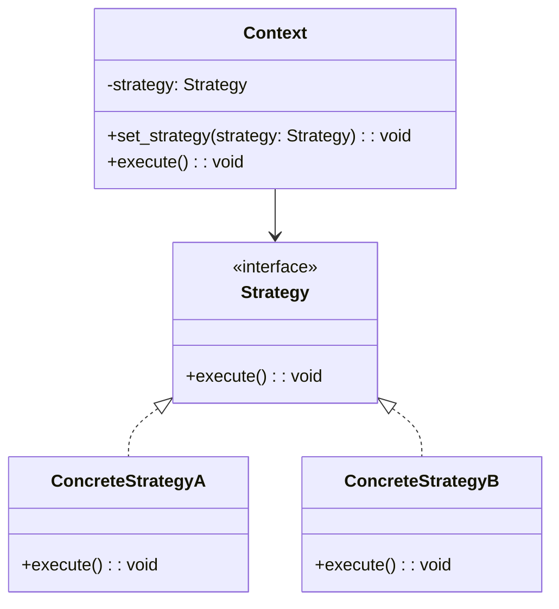

# Diagrama UML - Strategy

```mermaid
classDiagram
    class Context {
        -strategy: Strategy
        +set_strategy(strategy: Strategy): void
        +execute(): void
    }
    class Strategy {
        <<interface>>
        +execute(): void
    }
    class ConcreteStrategyA {
        +execute(): void
    }
    class ConcreteStrategyB {
        +execute(): void
    }
    Context --> Strategy
    Strategy <|.. ConcreteStrategyA
    Strategy <|.. ConcreteStrategyB
```

> Este diagrama ilustra o padrão Strategy, mostrando como o contexto delega a execução para diferentes estratégias, promovendo flexibilidade e baixo acoplamento.
